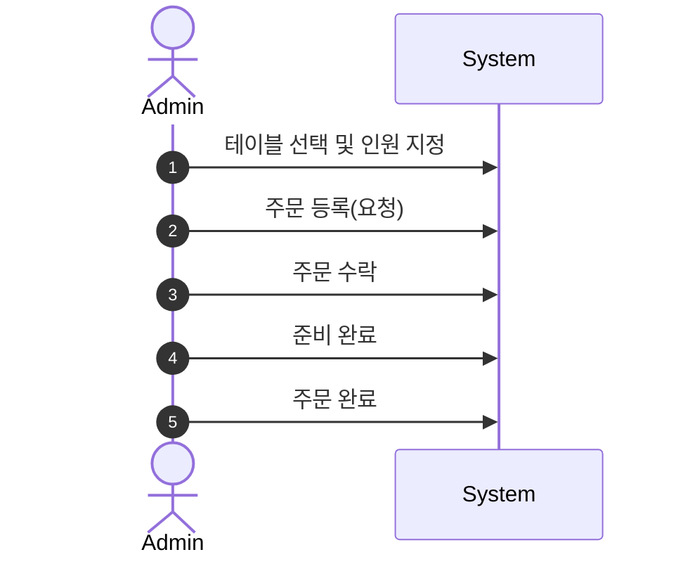
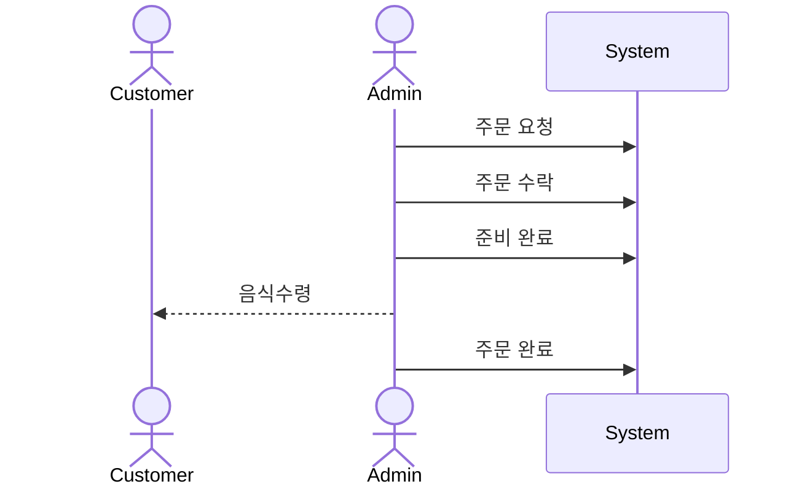
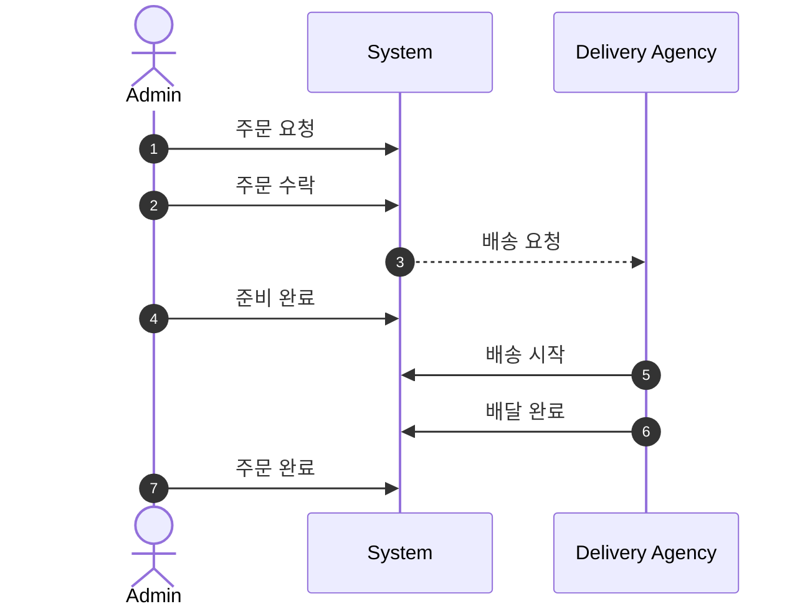

# 키친포스

## 요구 사항

### 상품

- 상품을 등록할 수 있다.
- 상품의 가격이 올바르지 않으면 등록할 수 없다.
    - 상품의 가격은 0원 이상이어야 한다.
- 상품의 이름이 올바르지 않으면 등록할 수 없다.
    - 상품의 이름에는 비속어가 포함될 수 없다.
- 상품의 가격을 변경할 수 있다.
- 상품의 가격이 올바르지 않으면 변경할 수 없다.
    - 상품의 가격은 0원 이상이어야 한다.
- 상품의 가격이 변경될 때 메뉴의 가격이 메뉴에 속한 상품 금액의 합보다 크면 메뉴가 숨겨진다.
- 상품의 목록을 조회할 수 있다.

### 메뉴 그룹

- 메뉴 그룹을 등록할 수 있다.
- 메뉴 그룹의 이름이 올바르지 않으면 등록할 수 없다.
    - 메뉴 그룹의 이름은 비워 둘 수 없다.
- 메뉴 그룹의 목록을 조회할 수 있다.

### 메뉴

- 1 개 이상의 등록된 상품으로 메뉴를 등록할 수 있다.
- 상품이 없으면 등록할 수 없다.
- 메뉴에 속한 상품의 수량은 0 이상이어야 한다.
- 메뉴의 가격이 올바르지 않으면 등록할 수 없다.
    - 메뉴의 가격은 0원 이상이어야 한다.
- 메뉴에 속한 상품 금액의 합은 메뉴의 가격보다 크거나 같아야 한다.
- 메뉴는 특정 메뉴 그룹에 속해야 한다.
- 메뉴의 이름이 올바르지 않으면 등록할 수 없다.
    - 메뉴의 이름에는 비속어가 포함될 수 없다.
- 메뉴의 가격을 변경할 수 있다.
- 메뉴의 가격이 올바르지 않으면 변경할 수 없다.
    - 메뉴의 가격은 0원 이상이어야 한다.
- 메뉴에 속한 상품 금액의 합은 메뉴의 가격보다 크거나 같아야 한다.
- 메뉴를 노출할 수 있다.
- 메뉴의 가격이 메뉴에 속한 상품 금액의 합보다 높을 경우 메뉴를 노출할 수 없다.
- 메뉴를 숨길 수 있다.
- 메뉴의 목록을 조회할 수 있다.

### 주문 테이블

- 주문 테이블을 등록할 수 있다.
- 주문 테이블의 이름이 올바르지 않으면 등록할 수 없다.
    - 주문 테이블의 이름은 비워 둘 수 없다.
- 빈 테이블을 해지할 수 있다.
- 빈 테이블로 설정할 수 있다.
- 완료되지 않은 주문이 있는 주문 테이블은 빈 테이블로 설정할 수 없다.
- 방문한 손님 수를 변경할 수 있다.
- 방문한 손님 수가 올바르지 않으면 변경할 수 없다.
    - 방문한 손님 수는 0 이상이어야 한다.
- 빈 테이블은 방문한 손님 수를 변경할 수 없다.
- 주문 테이블의 목록을 조회할 수 있다.

### 주문

- 1개 이상의 등록된 메뉴로 배달 주문을 등록할 수 있다.
- 1개 이상의 등록된 메뉴로 포장 주문을 등록할 수 있다.
- 1개 이상의 등록된 메뉴로 매장 주문을 등록할 수 있다.
- 주문 유형이 올바르지 않으면 등록할 수 없다.
- 메뉴가 없으면 등록할 수 없다.
- 매장 주문은 주문 항목의 수량이 0 미만일 수 있다.
- 매장 주문을 제외한 주문의 경우 주문 항목의 수량은 0 이상이어야 한다.
- 배달 주소가 올바르지 않으면 배달 주문을 등록할 수 없다.
    - 배달 주소는 비워 둘 수 없다.
- 빈 테이블에는 매장 주문을 등록할 수 없다.
- 숨겨진 메뉴는 주문할 수 없다.
- 주문한 메뉴의 가격은 실제 메뉴 가격과 일치해야 한다.
- 주문을 접수한다.
- 접수 대기 중인 주문만 접수할 수 있다.
- 배달 주문을 접수되면 배달 대행사를 호출한다.
- 주문을 서빙한다.
- 접수된 주문만 서빙할 수 있다.
- 주문을 배달한다.
- 배달 주문만 배달할 수 있다.
- 서빙된 주문만 배달할 수 있다.
- 주문을 배달 완료한다.
- 배달 중인 주문만 배달 완료할 수 있다.
- 주문을 완료한다.
- 배달 주문의 경우 배달 완료된 주문만 완료할 수 있다.
- 포장 및 매장 주문의 경우 서빙된 주문만 완료할 수 있다.
- 주문 테이블의 모든 매장 주문이 완료되면 빈 테이블로 설정한다.
- 완료되지 않은 매장 주문이 있는 주문 테이블은 빈 테이블로 설정하지 않는다.
- 주문 목록을 조회할 수 있다.

## 용어 사전
### 상품
| 한글명 | 영문명     | 설명                            |
| --- | --- |-------------------------------|
| 상품 | Product | 판매할 제품에 대한 가격과, 이름을 포함하는 구성 요소 |
| 비속어 | Cuss Word | **상품**의 이름으로 사용하기 적합하지 않은 말       |

### 메뉴
| 한글명   | 영문명          | 설명                                                           |
|-------|--------------|--------------------------------------------------------------|
| 상품    | Product      | **메뉴 상품**의 구성요소로 이름과 가격을 가진다                                 |
| 메뉴 상품 | Menu Product | **상품**과 그 **상품**의 수량을 가지는 메뉴의 구성 요소                          |
| 메뉴    | Menu         | 하나 이상의 **메뉴 상품**과 이름, 가격, 노출 여부를 가지고 있는 구성요소|
| 메뉴 가격 | Menu Price   | **메뉴**의 가격. 메뉴에 속한 모든 상품 가격과 수량의 합보다 항상 작아야 한다               |
| 메뉴 그룹 | Menu Group   | **메뉴**는 반드시 하나의 메뉴 그룹에 속해야 한다                                |
| 비속어 | Cuss Word    | **메뉴**의 이름으로 사용하기 적합하지 않은 말                                  |

### 메뉴 그룹
| 한글명    | 영문명     | 설명                                         |
|--------| --- |--------------------------------------------|
| 메뉴 그룹  | Menu Group | 메뉴들의 묶음을 나타낼 수 있는 이름을 가진 요소|

### 주문 테이블
| 한글명     | 영문명              | 설명                                         |
|---------|------------------|--------------------------------------------|
| 주문 테이블 | Order Table      | 이름과 **방문 손님 수**를 가지는 요소                    |

### 주문
| 한글명      | 영문명              | 설명                                                                                             |
|----------|------------------|------------------------------------------------------------------------------------------------|
| 메뉴       | Menu             | 주문의 최소 단위. 메뉴의 노출 여부에 따라 주문 가능 여부가 결정된다.(메뉴 노출 - 주문 가능, 메뉴 숨김 - 주문 불가능)                        |
| 주문 개별 항목 | Order Line Item  | 메뉴와 그 메뉴의 수량을 가지는 주문의 구성 요소                                                                    |
| 주문       | Order            | 하나 이상의 **주문 개별 항목**을 포함하는 요소로 생산이나 배송, 또는 서비스의 제공을 요구하는 행위                                     |
| 주문 유형    | Order Type       | 주문의 유형으로 매장 주문, 포장 주문, 배달 주문이 존재한다.                                                            |
| 매장 주문    | Eat In           | 매장에서 식사를 진행하는 **주문** 형태로 배정 된 테이블이 존재해야 한다                                                     |
| 포장 주문    | Takeout          | 직접 매장에 방문하여 상품을 수령하는 **주문** 형태                                                                 |
| 배달 주문    | Delivery         | **배달주소**를 지정하여 배달 대행사를 통해 상품을 수령하는 **주문** 형태                                                   |\
| 배달 주소    | Delivery Address | 상품을 수령 받을 장소                                                                                   |
| 배달 대행사   | Delivery Agency  | 음식점의 배달 서비스를 대신하고 가맹점(상점)으로부터 월간 회비 및 배달 요금을 과금하여 대행 기사에게 지급하는 '배달 중개 서비스’                     |
| 주문 상태    | Order Statys     | 주문의 진행 상태로 대기, 수락, 서빙, 배달중, 배달 완료, 주문완료 가 존재한다.                                                |
| 주문 대기    | Waiting          | **주문**을 요청한 상태                                                                                 |
| 주문 수락    | Accepted         | **주문**을 수락한 상태. **주문 대기** 상태에서만 수락이 가능하다.                                                      |
| 주문 서빙    | served           | **주문**을 고객에게 전달한 상태. **주문 수락** 상태에서만 서빙이 가능하다.                                                 |
| 배달중      | Delivering       | 배달이 시작된 상태. 배달 주문인 경우만 가능하다. **주문 수락** 상태이고 **배달 주문**일 경우에만 가능하다.                              |
| 배달 완료    | Delivered        | 배달이 완료된 상태. 배달 주문인 경우만 가능하다. **배달중**인 상태에서만 가능하다.                                              |
| 주문 완료    | Completed        | **주문**이 완료된 상태. **배달 주문**인 경우 배달이 완료되야 주문 완료가 가능하다. **매장 주문**과 **포장 주문**의 경우 **서빙**이 완료되야 가능하다. |
| 테이블 정리   | Table Clear      | **매장 주문**이 완료되어 더 이상 사용하지 않는 테이블을 다시 배정 가능한 상태로 만든다                                            |
| 주문 내역    | Order History    | **주문**의 상태와 물품이나 금액 따위를 나타닌다                                                                   |

## 모델링

## 상품
- `상품(Product)` 은 반드시 식별자와 **이름** 그리고 **가격**을 가진다.
- `상품(Product)` 은 가격을 변경할 수 있다.

## 메뉴 그룹
- `메뉴그룹(MenuGroup)` 은 반드시 식별자와 이름을 가진다. 

## 메뉴
- `메뉴 (Menu)` 는 하나 이상의 `메뉴 상품 (Menu Product)` , 이름, 가격, `메뉴그룹(Menu Group)`을 가진다.
- `메뉴 상품(Menu Product)` 는 식별자와 `상품(Product)`, 수량을 가진다.
- `메뉴 (Menu)` 는 가격을 변경할 수 있다.
- `메뉴 (Menu)` 는 `숨기(invisible)`거나 `노출(visible)`할 수 있다.

## 주문 테이블
- `주문테이블(order table)` 은 반드시 이름, `방문 손님 수(number of guest)`, 지정 여부를 가진다.
- `주문테이블(order table)` 은 `손님 수를 변경할 수 있다.

## 주문

### 공통

- `주문(Order)`는 식별자, 주문 상태, 주문 시간, 주문타입 그리고 `주문 라인 아이템(Order Line Item)` 을 가진다.
- `주문 라인 아이템(Order Line Item)` 은 식별자와 메뉴, 가격, 수량을 가진다.
- 
### 매장 주문

- `매장 주문(table order)` 주문은 `주문테이블(order table)`을 가진다.
- `매장 주문(table order)`은  **요청  →** **수락** → **준비 완료** → **주문 완료** 순서로 진행된다.
- 주문이 완료된 `매장 주문(table order)`은 테이블을 `정리(clean)` 한다.

### 포장 주문

- `포장 주문(take-out order)` 은  **요청  →** **수락** → **준비 완료** → **주문 완료** 순서로 진행된다.

### 배달 주문

- `배달주문(delivery order)` 은 반드시 `배달주소(delivery address)`를 가진다.
- `배달주문(delivery order)` 은 **요청** → **수락** → **준비완료** → **배달시작** → **배달완료** → **주문완료** 순서로 진행된다.

