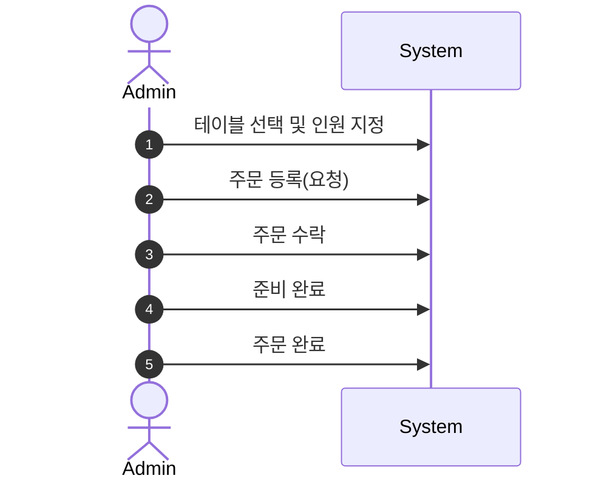
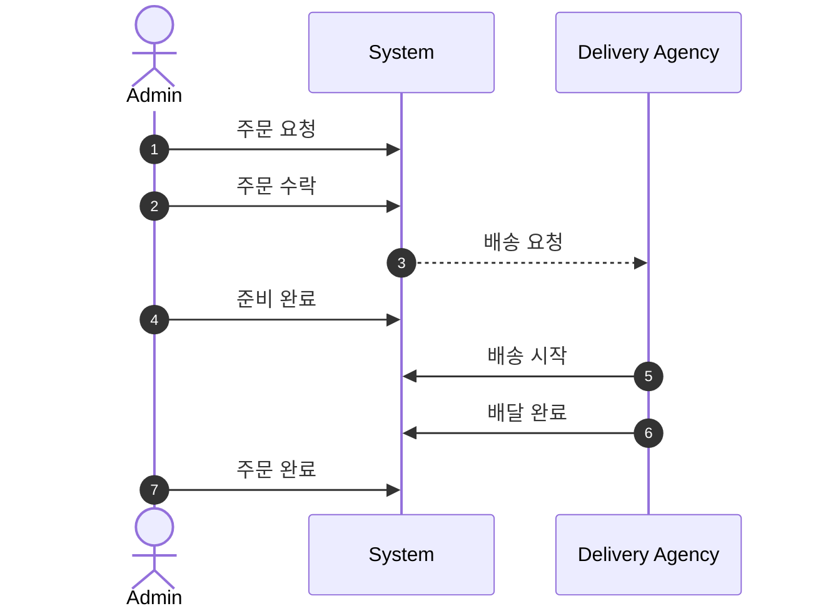
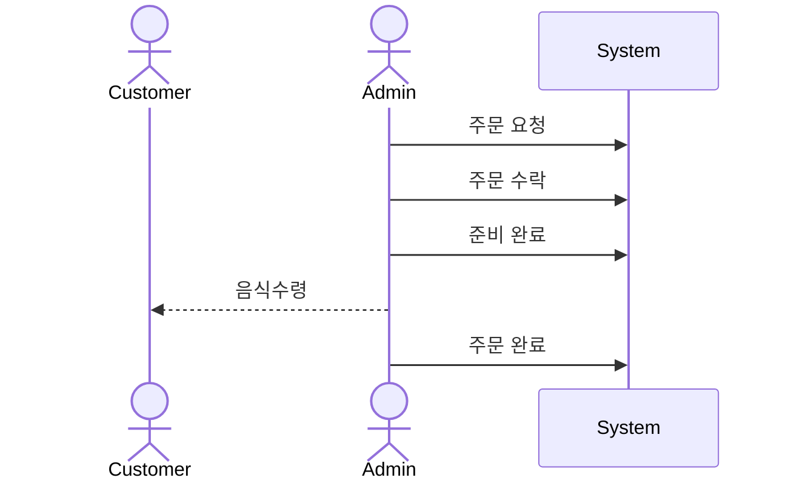

# 키친포스

## 요구 사항

### 상품

- 상품을 등록할 수 있다.
- 상품의 가격이 올바르지 않으면 등록할 수 없다.
    - 상품의 가격은 0원 이상이어야 한다.
- 상품의 이름이 올바르지 않으면 등록할 수 없다.
    - 상품의 이름에는 비속어가 포함될 수 없다.
- 상품의 가격을 변경할 수 있다.
- 상품의 가격이 올바르지 않으면 변경할 수 없다.
    - 상품의 가격은 0원 이상이어야 한다.
- 상품의 가격이 변경될 때 메뉴의 가격이 메뉴에 속한 상품 금액의 합보다 크면 메뉴가 숨겨진다.
- 상품의 목록을 조회할 수 있다.

### 메뉴 그룹

- 메뉴 그룹을 등록할 수 있다.
- 메뉴 그룹의 이름이 올바르지 않으면 등록할 수 없다.
    - 메뉴 그룹의 이름은 비워 둘 수 없다.
- 메뉴 그룹의 목록을 조회할 수 있다.

### 메뉴

- 1 개 이상의 등록된 상품으로 메뉴를 등록할 수 있다.
- 상품이 없으면 등록할 수 없다.
- 메뉴에 속한 상품의 수량은 0 이상이어야 한다.
- 메뉴의 가격이 올바르지 않으면 등록할 수 없다.
    - 메뉴의 가격은 0원 이상이어야 한다.
- 메뉴에 속한 상품 금액의 합은 메뉴의 가격보다 크거나 같아야 한다.
- 메뉴는 특정 메뉴 그룹에 속해야 한다.
- 메뉴의 이름이 올바르지 않으면 등록할 수 없다.
    - 메뉴의 이름에는 비속어가 포함될 수 없다.
- 메뉴의 가격을 변경할 수 있다.
- 메뉴의 가격이 올바르지 않으면 변경할 수 없다.
    - 메뉴의 가격은 0원 이상이어야 한다.
- 메뉴에 속한 상품 금액의 합은 메뉴의 가격보다 크거나 같아야 한다.
- 메뉴를 노출할 수 있다.
- 메뉴의 가격이 메뉴에 속한 상품 금액의 합보다 높을 경우 메뉴를 노출할 수 없다.
- 메뉴를 숨길 수 있다.
- 메뉴의 목록을 조회할 수 있다.

### 주문 테이블

- 주문 테이블을 등록할 수 있다.
- 주문 테이블의 이름이 올바르지 않으면 등록할 수 없다.
    - 주문 테이블의 이름은 비워 둘 수 없다.
- 빈 테이블을 해지할 수 있다.
- 빈 테이블로 설정할 수 있다.
- 완료되지 않은 주문이 있는 주문 테이블은 빈 테이블로 설정할 수 없다.
- 방문한 손님 수를 변경할 수 있다.
- 방문한 손님 수가 올바르지 않으면 변경할 수 없다.
    - 방문한 손님 수는 0 이상이어야 한다.
- 빈 테이블은 방문한 손님 수를 변경할 수 없다.
- 주문 테이블의 목록을 조회할 수 있다.

### 주문

- 1개 이상의 등록된 메뉴로 배달 주문을 등록할 수 있다.
- 1개 이상의 등록된 메뉴로 포장 주문을 등록할 수 있다.
- 1개 이상의 등록된 메뉴로 매장 주문을 등록할 수 있다.
- 주문 유형이 올바르지 않으면 등록할 수 없다.
- 메뉴가 없으면 등록할 수 없다.
- 매장 주문은 주문 항목의 수량이 0 미만일 수 있다.
- 매장 주문을 제외한 주문의 경우 주문 항목의 수량은 0 이상이어야 한다.
- 배달 주소가 올바르지 않으면 배달 주문을 등록할 수 없다.
    - 배달 주소는 비워 둘 수 없다.
- 빈 테이블에는 매장 주문을 등록할 수 없다.
- 숨겨진 메뉴는 주문할 수 없다.
- 주문한 메뉴의 가격은 실제 메뉴 가격과 일치해야 한다.
- 주문을 접수한다.
- 접수 대기 중인 주문만 접수할 수 있다.
- 배달 주문을 접수되면 배달 대행사를 호출한다.
- 주문을 서빙한다.
- 접수된 주문만 서빙할 수 있다.
- 주문을 배달한다.
- 배달 주문만 배달할 수 있다.
- 서빙된 주문만 배달할 수 있다.
- 주문을 배달 완료한다.
- 배달 중인 주문만 배달 완료할 수 있다.
- 주문을 완료한다.
- 배달 주문의 경우 배달 완료된 주문만 완료할 수 있다.
- 포장 및 매장 주문의 경우 서빙된 주문만 완료할 수 있다.
- 주문 테이블의 모든 매장 주문이 완료되면 빈 테이블로 설정한다.
- 완료되지 않은 매장 주문이 있는 주문 테이블은 빈 테이블로 설정하지 않는다.
- 주문 목록을 조회할 수 있다.

## 용어 사전

### 공통
| 한글명 | 영문명         | 설명                                     |
|-----|-------------|----------------------------------------|
| 금지어 | banned word | 이름으로 사용하기 적합하지 않은 단어. 저속한 말과 욕설을 포함한다. |

### 상품 
| 한글명 | 영문명     | 설명                                                                      |
|-----|---------|-------------------------------------------------------------------------|
| 상품  | product | 판매를 목적으로 하는 재화로 가격과, 이름을 가진다. 해당 프로젝트에서는 음식을 다룬다.   e.g 미트파이, 레몬에이드 |

### 메뉴 
| 한글명   | 영문명          | 설명                                                                                                                               |
|-------|--------------|----------------------------------------------------------------------------------------------------------------------------------|
| 메뉴 상품 | menu product | 상품과 그 상품의 수량을 가지는 메뉴의 구성 요소                                                                                                      |
| 메뉴    | menu         | 메뉴 상품을 하나 이상 포함하여 구성된 형태로 이름과 가격을 가진다. 음식들을 개별적으로 주문하는 것보다 가격이 같거나 낮아야 한다.    e.g 패스트푸드 식당에서 제공하는 가장 기본적인 메뉴 구성으로 음식과 음료가 있다. |
| 메뉴 숨김 | invisible    | 메뉴를 숨긴다.                                                                                                                         |
| 메뉴 노출 | visible      | 메뉴를 노출한다.                                                                         |

### 메뉴 그룹  
| 한글명   | 영문명        | 설명                           |
|-------|------------|------------------------------|
| 메뉴 그룹 | menu group | 특정 주제에 관한 메뉴들의 집합으로 이름을 가진다. |

### 테이블(주문 테이블)
| 한글명      | 영문명              | 설명                                        |
|----------|------------------|-------------------------------------------|
| 테이블      | table            | 테이블 서비스를 위해 추가 및 변경이 가능한 개체로 이름을 가진다.     |
| 방문한 손님 수 | number of guests | 해당 테이블을 사용하고 있는 고객의 수로 객단가를 계산하기 위해 필요하다. |
| 테이블 지정   | select (table)   | 사용할 테이블을 선택한다.                            |
| 테이블 정리   | clean (table)    | 사용한 테이블을 정리한다.                            |

### 주문  
| 한글명      | 영문명                       | 설명                                                                       |
|----------|---------------------------|--------------------------------------------------------------------------|
| 메뉴       | menu                      | 주문의 최소 단위                                                                |
| 메뉴 숨김    | invisible                 | 주문 불가능한 메뉴의 상태 e.g 숨김처리되어 배X의민족에서 보이지 않습니다.                              |
| 메뉴 노출    | visible                   | 주문 가능한 메뉴의 상태                                                            |
| 주문 개별 항목 | order line item           | 메뉴와 그 메뉴의 수량을 가지는 주문의 구성 요소                                              |
| 주문       | order                     |  하나 이상의 주문 개별 항목 포함하여 생산이나 배송, 또는 서비스의 제공을 요구하는 행위                       |
| 매장 주문    | table order               | 매장에서 식사를 진행하는 주문 서비스                                                     |
| 테이블 지정   | assign (table)            | 사용할 테이블을 선택한다. 매장 주문시 반드시 테이블이 지정되어야 한다.                                 |
| 테이블 정리   | clean (table)             | 사용한 테이블을 정리한다. 식사가 끝난 테이블을 다시 사용 가능한 상태로 변경한다.                           |
| 포장 주문    | take-out order            | 직접 매장에 방문하여 음식을 수령하는 주문 서비스                                              |
| 배달 주문    | delivery order            | 배달주소를 지정하여 배달 대행사를 통해 음식/상품을 수령하는 주문 서비스                                 |
| 배달 주소    | delivery address          | 상품을 수령 받을 장소                                                             |
| 배달 대행사   | delivery agency           | 음식점의 배달 서비스를 대신하고 가맹점(상점)으로부터 월간 회비 및 배달 요금을 과금하여 대행 기사에게 지급하는 배달 중개 서비스 |
| 주문등록     | order request             | 원하는 음식과 서비스 형태를 결정하여 주문을 요청합니다.                                          |
| 주문수락     | order acceptance          | 주문을 수락하고 조리를 시작합니다.                                                      |
| 준비(조리)완료 | order ready               | 요청한 음식이 준비되어 고객에게 인계할 수 있습니다.                                            |
| 배달시작     | delivery start            | 준비된 음식이 배달이 시작 됩니다.                                                      |
| 배달완료     | delivery completed        | 준비된 음식이 고객에게 배달되어 고객이 수령합니다.                                             |
| 주문완료     | order completed           | 음식의 제공과 신청한 서비스가 모두 완료                                                   |
| 주문 내역    | order information         | 주문의 상태와 물품이나 금액 따위를 나타낸다.                                                |
| 주문 조회    | order information inquiry | 주문 내역을 확인 할 수 있다.                                                        |

### 모델링

주요 비지니스 도메인 모델링

## 상품

- `상품(Product)` 은 반드시 식별자와 **이름** 그리고 **가격**을 가진다.
- `상품(Product)` 의 이름은 `금지어(banned word)` 를 포함할 수 없다.
- `상품(Product)` 의 가격은 0보다 큰 값을 가져야 한다.
- `상품(Product)` 의 가격은 변경될 수 있다.

## 메뉴

- `메뉴그룹(MenuGroup)` 은 반드시 식별자와 이름을 가진다.
- `메뉴그룹(MenuGroup)`의 이름은 `금지어(banned word)` 를 포함 할 수 없다.
- `메뉴 (Menu)` 는 하나 이상의 `메뉴 상품 (Menu Product)` , 이름, 가격을 가진다.
- `메뉴 상품(Menu Product)` 는 식별자와 `상품(Product)`, 수량을 가진다.
- `메뉴 (Menu)`의 가격은 0보다 큰 값을 가져야 하며, 속한 `메뉴 상품 (Menu Product)`의 가격의 합보다 작거나 같은 가격을 가져야 한다.
- `메뉴 (Menu)` 는 반드시 하나의 `메뉴그룹(Menu Group)` 에 속해야 한다.
- `메뉴 (Menu)` 의 가격은 변경될 수 있다.
- `메뉴 (Menu)` 를 `숨기(invisible)`거나 `노출(visible)`할 수 있다.

## 주문

### 공통

- `주문(Order)`는 식별자, 주문 상태, 주문 시간, 주문타입 그리고 `주문 라인 아이템(Order Line Item)` 을 가진다.
- `주문 라인 아이템(Order Line Item)` 은 식별자와 메뉴, 가격, 수량을 가진다.
- `메뉴(Menu)` 가 `노출(visible)` 상태일때만 주문 가능하며, **표기된(displayed)** 가격과 주문 가격이 일치해야 한다.

### 매장 주문

- `매장 주문(table order)`은  **요청  →** **수락** → **준비 완료** → **주문 완료** 순서로 진행된다.
- `주문테이블(order table)` 은 반드시 이름, `방문 손님 수(number of guest)`, 지정 여부를 가진다.
- `주문테이블(order table)` 의 방문 손님 수는 0 이상이여야 한다. (**필수값**이 아니다.)
- `주문테이블(order table)` 은 `지정(assign)`되어 있지 않으면 손님 수를 변경할 수 없다.
- `매장 주문(table order)` 주문은 `지정(assign)` 된  `주문테이블(order table)`을 가진다.
- `매장 주문(table order)` 이 주문완료 된 경우 테이블을 `정리(clean)` 해야 한다.
- `매장 주문(table order)` 의 경우 `주문 라인 아이템(Order Line Item)` 의 수량이 0보다 작을 수 있다.

### 배달 주문

- `배달주문(delivery order)` 은 **요청** → **수락** → **준비완료** → **배달시작** → **배달완료** → **주문완료** 순서로 진행된다.
- `배달주문(delivery order)` 은 반드시 `배달주소(delivery address)`를 가진다.
- `배달주문(delivery order)` 이 수락되면 `배달 대행사(deleivery agency)` 에 배달을 요청해야 한다.
- `배달주문(delivery order)` 의 경우 `주문 라인 아이템(order line item)` 의 수량이 0보다 커야 한다.

### 포장 주문

- `포장 주문(take-out order)` 은  **요청  →** **수락** → **준비 완료** → **주문 완료** 순서로 진행된다.
- `포장 주문(take-out order)` 의 경우 `주문 라인 아이템(order line item)` 의 수량이 0보다 커야 한다.
