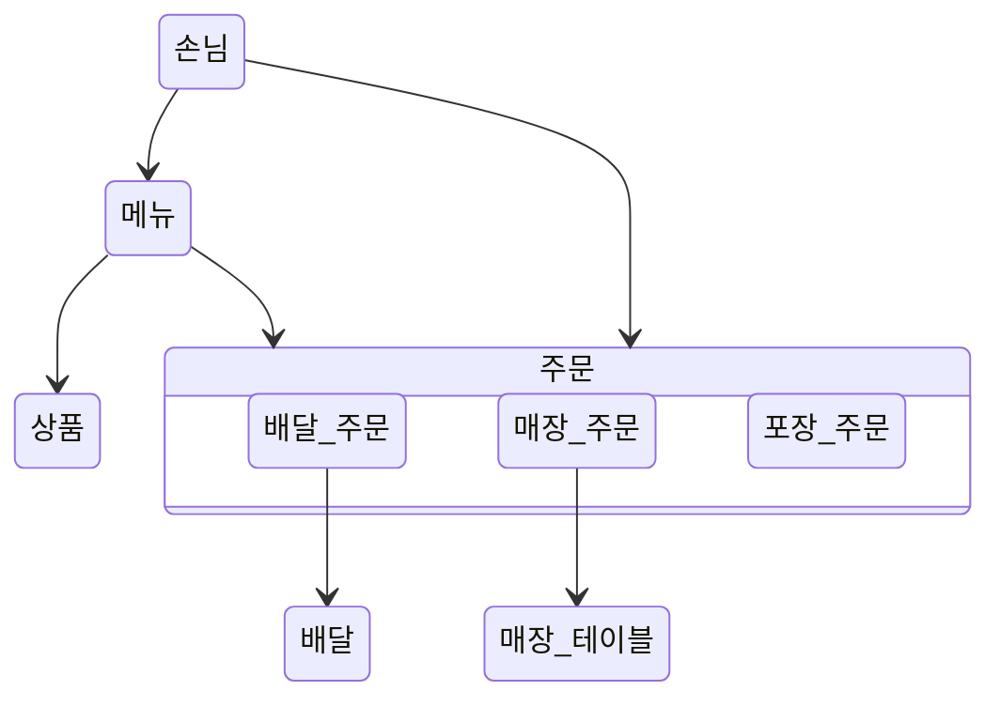

# 키친포스

## 퀵 스타트

```sh
cd docker
docker compose -p kitchenpos up -d
```

## 요구 사항

### 상품

- 상품을 등록할 수 있다.
- 상품의 가격이 올바르지 않으면 등록할 수 없다.
    - 상품의 가격은 0원 이상이어야 한다.
- 상품의 이름이 올바르지 않으면 등록할 수 없다.
    - 상품의 이름에는 비속어가 포함될 수 없다.
- 상품의 가격을 변경할 수 있다.
- 상품의 가격이 올바르지 않으면 변경할 수 없다.
    - 상품의 가격은 0원 이상이어야 한다.
- 상품의 가격이 변경될 때 메뉴의 가격이 메뉴에 속한 상품 금액의 합보다 크면 메뉴가 숨겨진다.
- 상품의 목록을 조회할 수 있다.

### 메뉴 그룹

- 메뉴 그룹을 등록할 수 있다.
- 메뉴 그룹의 이름이 올바르지 않으면 등록할 수 없다.
    - 메뉴 그룹의 이름은 비워 둘 수 없다.
- 메뉴 그룹의 목록을 조회할 수 있다.

### 메뉴

- 1 개 이상의 등록된 상품으로 메뉴를 등록할 수 있다.
- 상품이 없으면 등록할 수 없다.
- 메뉴에 속한 상품의 수량은 0 이상이어야 한다.
- 메뉴의 가격이 올바르지 않으면 등록할 수 없다.
    - 메뉴의 가격은 0원 이상이어야 한다.
- 메뉴에 속한 상품 금액의 합은 메뉴의 가격보다 크거나 같아야 한다.
- 메뉴는 특정 메뉴 그룹에 속해야 한다.
- 메뉴의 이름이 올바르지 않으면 등록할 수 없다.
    - 메뉴의 이름에는 비속어가 포함될 수 없다.
- 메뉴의 가격을 변경할 수 있다.
- 메뉴의 가격이 올바르지 않으면 변경할 수 없다.
    - 메뉴의 가격은 0원 이상이어야 한다.
- 메뉴에 속한 상품 금액의 합은 메뉴의 가격보다 크거나 같아야 한다.
- 메뉴를 노출할 수 있다.
- 메뉴의 가격이 메뉴에 속한 상품 금액의 합보다 높을 경우 메뉴를 노출할 수 없다.
- 메뉴를 숨길 수 있다.
- 메뉴의 목록을 조회할 수 있다.

### 주문 테이블

- 주문 테이블을 등록할 수 있다.
- 주문 테이블의 이름이 올바르지 않으면 등록할 수 없다.
    - 주문 테이블의 이름은 비워 둘 수 없다.
- 빈 테이블을 해지할 수 있다.
- 빈 테이블로 설정할 수 있다.
- 완료되지 않은 주문이 있는 주문 테이블은 빈 테이블로 설정할 수 없다.
- 방문한 손님 수를 변경할 수 있다.
- 방문한 손님 수가 올바르지 않으면 변경할 수 없다.
    - 방문한 손님 수는 0 이상이어야 한다.
- 빈 테이블은 방문한 손님 수를 변경할 수 없다.
- 주문 테이블의 목록을 조회할 수 있다.

### 주문

- 1개 이상의 등록된 메뉴로 배달 주문을 등록할 수 있다.
- 1개 이상의 등록된 메뉴로 포장 주문을 등록할 수 있다.
- 1개 이상의 등록된 메뉴로 매장 주문을 등록할 수 있다.
- 주문 유형이 올바르지 않으면 등록할 수 없다.
- 메뉴가 없으면 등록할 수 없다.
- 매장 주문은 주문 항목의 수량이 0 미만일 수 있다.
- 매장 주문을 제외한 주문의 경우 주문 항목의 수량은 0 이상이어야 한다.
- 배달 주소가 올바르지 않으면 배달 주문을 등록할 수 없다.
    - 배달 주소는 비워 둘 수 없다.
- 빈 테이블에는 매장 주문을 등록할 수 없다.
- 숨겨진 메뉴는 주문할 수 없다.
- 주문한 메뉴의 가격은 실제 메뉴 가격과 일치해야 한다.
- 주문을 접수한다.
- 접수 대기 중인 주문만 접수할 수 있다.
- 배달 주문을 접수되면 배달 대행사를 호출한다.
- 주문을 서빙한다.
- 접수된 주문만 서빙할 수 있다.
- 주문을 배달한다.
- 배달 주문만 배달할 수 있다.
- 서빙된 주문만 배달할 수 있다.
- 주문을 배달 완료한다.
- 배달 중인 주문만 배달 완료할 수 있다.
- 주문을 완료한다.
- 배달 주문의 경우 배달 완료된 주문만 완료할 수 있다.
- 포장 및 매장 주문의 경우 서빙된 주문만 완료할 수 있다.
- 주문 테이블의 모든 매장 주문이 완료되면 빈 테이블로 설정한다.
- 완료되지 않은 매장 주문이 있는 주문 테이블은 빈 테이블로 설정하지 않는다.
- 주문 목록을 조회할 수 있다.

## 용어 사전

### 상품

| 한글명   | 영문명          | 설명                |
|-------|--------------|-------------------|
| 상품    | product      | 판매할 수 있는 단일 식품    |
| 이름    | name         | 상품의 이름            |
| 가격    | price        | 상품의 가격(₩)         |
| 등록    | create       | 포스기에 신규로 상품을 등록한다 |
| 가격 변경 | change price | 등록된 상품의 가격을 변경한다  |

### 메뉴 그룹

| 한글명   | 영문명        | 설명                   |
|-------|------------|----------------------|
| 메뉴 그룹 | menu group | 메뉴들을 종류에 따라 모아둔 그룹   |
| 이름    | name       | 메뉴 그룹의 이름            |
| 등록    | create     | 포스기에 신규로 메뉴 그룹을 등록한다 |

### 메뉴

| 한글명   | 영문명          | 설명                      |
|-------|--------------|-------------------------|
| 메뉴    | menu         | 고객들에게 제공되는 구성품들과 가격의 정보 |
| 이름    | name         | 메뉴의 이름                  |
| 가격    | price        | 메뉴의 가격(₩)               |
| 구성품   | menu product | 메뉴를 구성하고 있는 상품들         |
| 등록    | create       | 포스기에 신규로 메뉴를 등록한다       |
| 활성화   | display      | 메뉴를 고객이 구매할수 있게 한다      |
| 비활성화  | hide         | 메뉴를 고객이 구매할수 없게 한다      |
| 가격 변경 | change price | 등록된 메뉴의 가격을 변경한다        |

### 매장 테이블

| 한글명     | 영문명                     | 설명                      |
|---------|-------------------------|-------------------------|
| 매장 테이블  | order table             | 매장 내 고객이 이용할 수 있는 테이블   |
| 이름      | name                    | 매장 테이블을 지칭하는 이름         |
| 고객 수    | number of guest         | 매장 테이블을 이용 중인 인원 수      |
| 이용 중    | occupied                | 매장 테이블이 이용 중인 상태        |
| 등록      | create                  | 포스기에 신규로 매장 테이블을 등록한다   |
| 이용      | mark occupied           | 매장테이블의 상태를 이용 중으로 변경한다. |  
| 정리      | clear                   | 매장 테이블을 비운다             |
| 고객 수 변경 | change number of guests | 매장 테이블을 이용중인 인원 수를 변경한다 |

### 주문

| 한글명      | 영문명               | 설명                             |
|----------|-------------------|--------------------------------|
| 주문       | order             | 고객이 선택한 메뉴들                    |
| 배달 주문    | delivery order    | 매장이 음식을 배달하여 고객이 집에서 먹는 형태의 주문 |
| 매장 식사 주문 | eat-in order      | 매장 내에서 식사하는 형태의 주문             |
| 포장 주문    | takeout order     | 매장에서 포장하여 고객이 외부에서 먹는 형태의 주문   |
| 접수 대기 중  | WAITING           | 주문이 접수되어 매장의 수락 대기중            |
| 수락됨      | ACCEPTED          | 매장이 주문 수락                      |
| 전달됨      | SERVED            | 매장에서 주문한 구성품이 전달됨              |
| 배달 중     | DELIVERING        | 주문이 배달 중                       |
| 배달 완료    | DELIVERED         | 배달 완료                          |
| 완료됨      | COMPLETED         | 주문 완료                          |
| 주문 일자    | order datetime    | 고객이 주문한 날짜와 시간                 |
| 주문 내역    | order line items  | 고객이 주문한 메뉴들                    |
| 라이더 요청   | request delivery  | 배달주문이 수락될때 라이더를 요청한다           |
| 등록       | create            | 고객이 매장에 주문을 한다                 | 
| 수락       | accept            | 매장이 고객의 주문을 수락한다               | 
| 전달       | serve             | 매장에서 고객이 주문한 구성품을 전달한다         |
| 배달 시작    | start delivery    | 라이더가 배달을 시작한다                  |
| 배달 완료    | complete delivery | 라이더가 고객에게 주문을 전달하고 배달을 완료한다    |
| 완료       | complete          | 매장이 주문을 완료한다                   |

### 공통

| 한글명    | 영문명            | 설명             |
|--------|----------------|----------------|
| 비속어    | profanity      | 욕설이나 부적절한 언어   |
| 라이더    | kitchen rider  | 주문을 배달하는 사람    |
| 라이더 부서 | kitchen riders | 배달을 총괄하는 외부 부서 |

## 모델링

### 상품(Product)

- `Product`는 `Price`와 `DisplayedName`을 가진다

### 메뉴 그룹(MenuGroup)

- `MenuGroup`은 `Name`을 가진다

### 메뉴(Menu)

- `Menu`는 `DisplayedName`, `Price`, `MenuProducts` 그리고 `DisplayStatus`를 가진다
- `Menu`는 `MenuGroup`에 포함된다
- `Menu`의 `Price`가 `MenuProducts`의 `TotalPrice`보다 크다면 구매할 수 없는 상태가 된다

### 구성품 (MenuProduct)

- `MenuProduct`는 `Product`, `Quantity`, `Menu`를 가진다

### 매장 테이블(OrderTable)

- `OrderTable`은 `Name`, `NumberOfGuest`, `OccupiedStatus`를 가지고 있다
- `OrderTable`은 이용 중일 때에만 `NumberOfGuest`를 변경할 수 있다

### 주문(Order)

- `Order`는 `OrderStatus`, `OrderLineItems`, `OrderDateTime` 그리고 `OrderType`을 가진다
- `OrderType`에는 `TakeOutOrder`, `DeliveryOrder`, `EatInOrder`가 있다

### 주문 내역(OrderLineItem)

- `OrderLineItem`은 주문한 `Menu`, `Price` 그리고 `Menu`의 `Quantity` 가진다
- `OrderLineItem`의 활성화 상태인 `Menu`만 주문할 수 있다
- `OrderLineItem`의 `Menu` 정보와 매장의 `Menu`는 일치하여야 한다

### 포장 주문(TakeOutOrder)

- `TakeOutOrder`의 흐름은 `접수 대기 중` -> `수락됨` -> `포장 후 전달됨` -> `완료됨` 이다
- `TakeOutOrder`의 `OrderLineItem`의 수량은 1개 이상이어야 한다

### 배달 주문(DeliveryOrder)

- `DeliveryOrder`의 흐름은 `접수 대기 중` -> `수락됨` -> `배달 기사에게 전달됨` -> `배달 중` -> `배달 완료` -> `완료됨` 이다
- `DeliveryOrder`는 등록 시 `DeliveryAddress`가 있어야 한다
- `DeliveryOrder`가 수락되면 `KitchenridersClient`에서 배달 대행 업체로 부터 배달 기사를 배정받는다
- `DeliveryOrder`의 `OrderLineItem`의 수량은 1개 이상이어야 한다

### 매장 식사 주문(EatInOrder)

- `EatInOrder`의 흐름은 `접수 대기 중` -> `수락됨` -> `매장 테이블로 전달됨` -> `완료됨` 이다
- `EatInOrder`는 등록 시 손님이 앉을수 있는 `OrderTable`가 있어야 한다
- `EatInOrder`는 취소될 수 있다
    - `EatInOrder`의 `OrderLineItem`의 수량은 0개 이하일 수 있다
- `EatInOrder`가 완료되면 `OrderTable`를 정리한다

## Value Objects

### 공개 이름(DisplayedName)

- `DisplayedName`은 1자 이상의 문자를 가진다
    - `DisplayedName`은 `PurgomalumClient`을 통해 비속어 여부를 검사를 한다

### 가격(Price)

- `Price`는 0원 이상의 정수를 가진다
- `Product`나 `Menu`의 `Price`를 변경하면 `MenuPriceValidator`를 통해 `Menu`의 `DisplayStatus`를 변경한다

### 전체 구성품 (MenuProducts)

- `MenuProducts`는 `Menu`에 포함된 모든 `MenuProduct` 가진다
- `MenuProducts`에서 전체 구성품의 `TotalPrice`를 생성한다

## 맵?


