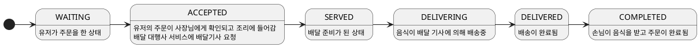
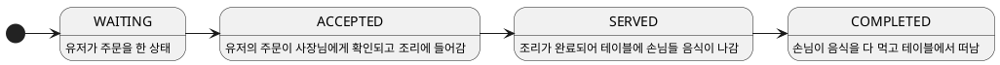
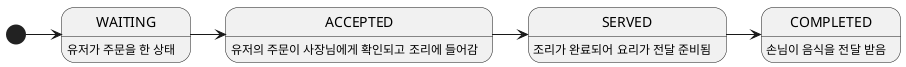

# 키친포스

## 퀵 스타트

```sh
cd docker
docker compose -p kitchenpos up -d
```

## 요구 사항

### 상품

- 상품을 등록할 수 있다.
- 상품의 가격이 올바르지 않으면 등록할 수 없다.
    - 상품의 가격은 0원 이상이어야 한다.
- 상품의 이름이 올바르지 않으면 등록할 수 없다.
    - 상품의 이름에는 비속어가 포함될 수 없다.
- 상품의 가격을 변경할 수 있다.
- 상품의 가격이 올바르지 않으면 변경할 수 없다.
    - 상품의 가격은 0원 이상이어야 한다.
- 상품의 가격이 변경될 때 메뉴의 가격이 메뉴에 속한 상품 금액의 합보다 크면 메뉴가 숨겨진다.
- 상품의 목록을 조회할 수 있다.

### 메뉴 그룹

- 메뉴 그룹을 등록할 수 있다.
- 메뉴 그룹의 이름이 올바르지 않으면 등록할 수 없다.
    - 메뉴 그룹의 이름은 비워 둘 수 없다.
- 메뉴 그룹의 목록을 조회할 수 있다.

### 메뉴

- 1 개 이상의 등록된 상품으로 메뉴를 등록할 수 있다.
- 상품이 없으면 등록할 수 없다.
- 메뉴에 속한 상품의 수량은 0 이상이어야 한다.
- 메뉴의 가격이 올바르지 않으면 등록할 수 없다.
    - 메뉴의 가격은 0원 이상이어야 한다.
- 메뉴에 속한 상품 금액의 합은 메뉴의 가격보다 크거나 같아야 한다.
- 메뉴는 특정 메뉴 그룹에 속해야 한다.
- 메뉴의 이름이 올바르지 않으면 등록할 수 없다.
    - 메뉴의 이름에는 비속어가 포함될 수 없다.
- 메뉴의 가격을 변경할 수 있다.
- 메뉴의 가격이 올바르지 않으면 변경할 수 없다.
    - 메뉴의 가격은 0원 이상이어야 한다.
- 메뉴에 속한 상품 금액의 합은 메뉴의 가격보다 크거나 같아야 한다.
- 메뉴를 노출할 수 있다.
- 메뉴의 가격이 메뉴에 속한 상품 금액의 합보다 높을 경우 메뉴를 노출할 수 없다.
- 메뉴를 숨길 수 있다.
- 메뉴의 목록을 조회할 수 있다.

### 주문 테이블

- 주문 테이블을 등록할 수 있다.
- 주문 테이블의 이름이 올바르지 않으면 등록할 수 없다.
    - 주문 테이블의 이름은 비워 둘 수 없다.
- 빈 테이블을 해지할 수 있다.
- 빈 테이블로 설정할 수 있다.
- 완료되지 않은 주문이 있는 주문 테이블은 빈 테이블로 설정할 수 없다.
- 방문한 손님 수를 변경할 수 있다.
- 방문한 손님 수가 올바르지 않으면 변경할 수 없다.
    - 방문한 손님 수는 0 이상이어야 한다.
- 빈 테이블은 방문한 손님 수를 변경할 수 없다.
- 주문 테이블의 목록을 조회할 수 있다.

### 주문

- 1개 이상의 등록된 메뉴로 배달 주문을 등록할 수 있다.
- 1개 이상의 등록된 메뉴로 포장 주문을 등록할 수 있다.
- 1개 이상의 등록된 메뉴로 매장 주문을 등록할 수 있다.
- 주문 유형이 올바르지 않으면 등록할 수 없다.
- 메뉴가 없으면 등록할 수 없다.
- 매장 주문은 주문 항목의 수량이 0 미만일 수 있다.
- 매장 주문을 제외한 주문의 경우 주문 항목의 수량은 0 이상이어야 한다.
- 배달 주소가 올바르지 않으면 배달 주문을 등록할 수 없다.
    - 배달 주소는 비워 둘 수 없다.
- 빈 테이블에는 매장 주문을 등록할 수 없다.
- 숨겨진 메뉴는 주문할 수 없다.
- 주문한 메뉴의 가격은 실제 메뉴 가격과 일치해야 한다.
- 주문을 접수한다.
- 접수 대기 중인 주문만 접수할 수 있다.
- 배달 주문을 접수되면 배달 대행사를 호출한다.
- 주문을 서빙한다.
- 접수된 주문만 서빙할 수 있다.
- 주문을 배달한다.
- 배달 주문만 배달할 수 있다.
- 서빙된 주문만 배달할 수 있다.
- 주문을 배달 완료한다.
- 배달 중인 주문만 배달 완료할 수 있다.
- 주문을 완료한다.
- 배달 주문의 경우 배달 완료된 주문만 완료할 수 있다.
- 포장 및 매장 주문의 경우 서빙된 주문만 완료할 수 있다.
- 주문 테이블의 모든 매장 주문이 완료되면 빈 테이블로 설정한다.
- 완료되지 않은 매장 주문이 있는 주문 테이블은 빈 테이블로 설정하지 않는다.
- 주문 목록을 조회할 수 있다.

## 용어 사전

### 공통

| 한글명       | 영문명        | 설명                                    |
|-----------|------------|---------------------------------------|
| 손님        | Guest      | 메뉴를 골라서 주문하고, 상품을 받는 주체               |
| 사장님       | Owner      | 메뉴/메뉴그룹을 관리하고 주문 상태를 관리하는 주체          |
| 비속어       | Purgomalum | 손님에게 보이면 안되는 단어, 메뉴와 상품의 이름에 사용될 수 없다 |
| 가격        | Price      | 상품과 메뉴에서 사용되는 0이상의 숫자, 단위가 원화         |

### 메뉴

| 한글명        | 영문명                   | 설명                                                 |
|------------|-----------------------|----------------------------------------------------|
| 메뉴         | Menu                  | 메뉴는 한 개 이상의 상품으로 이루어져있는 주문의 단위                     |
| 메뉴 가격      | Menu Price            | 메뉴에는 상품가격과는 별개의 가격이 존재한다.                          |
| 메뉴 그룹      | MenuGroup             | 매뉴들을 묶은 이름을 가진 그룹                                  |
| 메뉴 노출 여부   | Displayed             | 노출 여부에 따라 손님에게 보이거나 주문 가능한 상태 여부가 결정된다             |
| 메뉴를 노출하다   | Display Menu          | 메뉴가 손님에게 보이고 주문 가능한 상태가 되게 함                       |
| 메뉴를 숨기다    | Hide Menu             | 메뉴가 손님에게 보이지 않고 주문 불가능한 상태가 되게 함                   |
| 메뉴 상품 수량   | Menu Product Quantity | 메뉴에 등록된 상품의 갯수                                     |
| 메뉴 가격 수정하다 | change Menu Price     | 메뉴의 가격을 수정한다. 메뉴 가격에는 상품가격과 메뉴상품수량에 따른 제약조건이 존재한다. |

### 상품

| 한글명          | 영문명                      | 설명                        |
|--------------|--------------------------|---------------------------|
| 상품           | Product                  | 가격을 가지고 있고 판매되는 제품        |
| 상품을 메뉴로 등록하다 | register Product to Menu | 상품이 메뉴에 속해서 판매 가능한 상태가 되다 |
| 상품을 등록해제하다   | unregister Product       | 상품이 메뉴에서 제외되어서 판매 불가능해지다  |

### 주문

| 한글명       | 영문명              | 설명                                                   |
|-----------|------------------|------------------------------------------------------|
| 주문하다      | Order            | 주문타입, 메뉴 정보를 이용해서 주문접수                               |
| 주문 유형     | OrderType        | 배달주문, 포장주문, 매장 주문으로 주문의 유형                           |
| 주문 상태     | OrderStatus      | 특정 주문이 얼마나 진행되었는지에 대한 정보(등록, 접수, 서빙, 완료)             |
| 주문을 접수한다  | Accept Order     | 생성된 주문을 매장에서 확인하고 요리를 시작한다                           |
| 주문을 서빙한다  | Serve Order      | 메뉴나 제품이 배달주문은 기사에게 , 홀, 포장 주문은 손님에게 전달된다             |
| 주문을 완료한다  | Complete Order   | 배달주문은 배달이 완료된 경우, 홀, 포장은 서빙이 완료된 경우이다                |
| 배달 대행사    | Riders Company   | 배달주문을 실제로 배달해주는 외부 업체                                |
| 테이블의 손님수  | number 0f guests | 테이블에 앉아있는 손님의 수, 점유되지 않은 테이블에서는 0이다                  |

### 테이블

| 한글명       | 영문명              | 설명                                                   |
|-----------|------------------|------------------------------------------------------|
| 주문테이블     | OrderTable       | 홀 주문시 필요한 테이블                                        |
| 테이블을 점유한다 | Occupy Table     | 홀 주문시 특정 테이블을 사용중인 상태로 만들어서 다른 주문에서 테이블을 사용할 수 없게 한다 |
| 점유를 해제한다  | Unoccupy Table   | 점유된 상태를 해제하여 다른 홀 주문이 해당 테이블을 점유할 수 있게 된다            |

### 주문아이템

| 한글명       | 영문명            | 설명                                                   |
|-----------|----------------|------------------------------------------------------|
| 주문아이템     | OrderLineItem  | 주문에 들어있는 메뉴의 종류별 갯수와 주문 당시의 가격을 기록하는 역할              |


## 모델링


### 가게 관리

> 사장님이 가게에서 판매할 메뉴/상품을 관리하는 context

#### 메뉴

 - 메뉴는 n가지 종류의 상품이 각 n개로 이루어져 있다.
 - 메뉴에는 이름과 가격이 존재한다.
 - 메뉴 이름에는 비속어를 쓸 수 없다.
 - 메뉴 가격은 상품 가격 * 상품 수량의 합보다 클 수 없다.
 - 메뉴는 노출 여부를 변경할 수 있다.
 - 노출 여부에 때라 손님에게 보이거나 보이지 않을 수 있으며, 주문 역시 되지 않는다.
 - 메뉴는 메뉴 그룹으로 묶을 수 있다.

#### 상품

 - 상품은 이름과 가격이 있다.
 - 상품 이름에는 비속어를 쓸 수 없다.
 - 상품의 이름이나 가격을 변경할 수 있다.
 - 상품의 가격이 변경될 때, 메뉴의 가격이 메뉴에 속한 상품 금액의 합보다 크면 메뉴가 노출 해제된다.


### 상품 주문

> 손님이 가게에서 메뉴를 골라서 주문하는 context

#### 메뉴

 - 주문 가능한 최소 단위로, 이름과 가격을 가진다.
 - 노출 되지 않는 메뉴는 주문할 수 없다.

#### 주문

 - 주문은 n개의 주문아이템으로 이루어진다.
 - 주문의 가격은 주문 아이템 가격의 합이다.

#### 주문아이템

 - 주문 아이템은 주문 메뉴와 갯수, 주문 당시의 가격을 기록한다.
 - 주문 당시의 가격은 당시 주문 메뉴 가격 * 주문 메뉴 갯수 이다.


### 배달 주문 관리

> 생성된 배달 주문이 손님에게 배달 완료되기까지 관리하는 context

#### 배달 주문

 - 배달 주문은 유효한 배달 주소가 필요하다.





### 홀 주문 관리

> 생성된 홀 주문이 손님에게 서빙되고 손님이 떠나기까지 관리하는 context

#### 홀 주문

 - 홀 주문은 점유되지 않는 테이블이 필요하다.




#### 주문 테이블

 - 테이블은 앉은 손님 숫자와 점유 여부를 가진다.
 - 처음 주문이 생성될 때 테이블을 점유한다.
 - 주문이 COMPLETED 가 되면 테이블 점유를 해제한다.

### 포장 주문 관리

> 생성된 포장 주문이 손님에게 전달 완료되기까지 관리하는 context

#### 포장 주문


