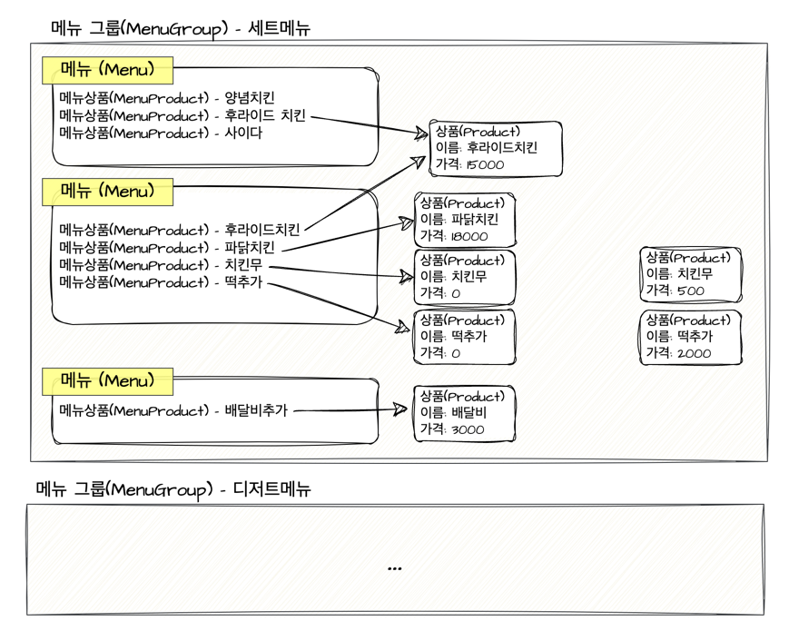
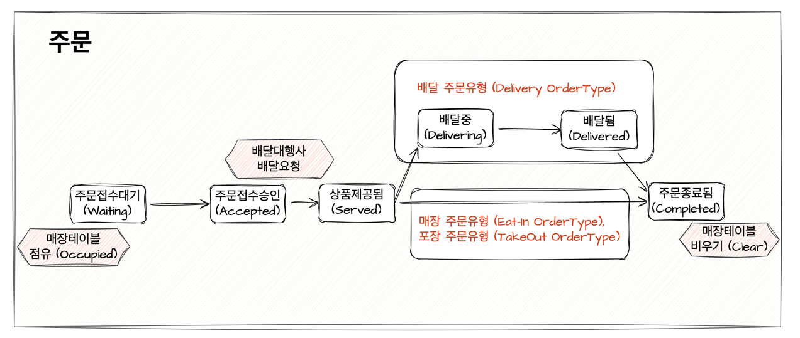

# 키친포스

## 퀵 스타트

```sh
cd docker
docker compose -p kitchenpos up -d
```

## 요구 사항

### 상품

- 상품을 등록할 수 있다.
- 상품의 가격이 올바르지 않으면 등록할 수 없다.
    - 상품의 가격은 0원 이상이어야 한다.
- 상품의 이름이 올바르지 않으면 등록할 수 없다.
    - 상품의 이름에는 비속어가 포함될 수 없다.
- 상품의 가격을 변경할 수 있다.
- 상품의 가격이 올바르지 않으면 변경할 수 없다.
    - 상품의 가격은 0원 이상이어야 한다.
- 상품의 가격이 변경될 때 메뉴의 가격이 메뉴에 속한 상품 금액의 합보다 크면 메뉴가 숨겨진다.
- 상품의 목록을 조회할 수 있다.

### 메뉴 그룹

- 메뉴 그룹을 등록할 수 있다.
- 메뉴 그룹의 이름이 올바르지 않으면 등록할 수 없다.
    - 메뉴 그룹의 이름은 비워 둘 수 없다.
- 메뉴 그룹의 목록을 조회할 수 있다.

### 메뉴

- 1 개 이상의 등록된 상품으로 메뉴를 등록할 수 있다.
- 상품이 없으면 등록할 수 없다.
- 메뉴에 속한 상품의 수량은 0 이상이어야 한다.
- 메뉴의 가격이 올바르지 않으면 등록할 수 없다.
    - 메뉴의 가격은 0원 이상이어야 한다.
- 메뉴에 속한 상품 금액의 합은 메뉴의 가격보다 크거나 같아야 한다.
- 메뉴는 특정 메뉴 그룹에 속해야 한다.
- 메뉴의 이름이 올바르지 않으면 등록할 수 없다.
    - 메뉴의 이름에는 비속어가 포함될 수 없다.
- 메뉴의 가격을 변경할 수 있다.
- 메뉴의 가격이 올바르지 않으면 변경할 수 없다.
    - 메뉴의 가격은 0원 이상이어야 한다.
- 메뉴에 속한 상품 금액의 합은 메뉴의 가격보다 크거나 같아야 한다.
- 메뉴를 노출할 수 있다.
- 메뉴의 가격이 메뉴에 속한 상품 금액의 합보다 높을 경우 메뉴를 노출할 수 없다.
- 메뉴를 숨길 수 있다.
- 메뉴의 목록을 조회할 수 있다.

### 주문 테이블

- 주문 테이블을 등록할 수 있다.
- 주문 테이블의 이름이 올바르지 않으면 등록할 수 없다.
    - 주문 테이블의 이름은 비워 둘 수 없다.
- 빈 테이블을 해지할 수 있다.
- 빈 테이블로 설정할 수 있다.
- 완료되지 않은 주문이 있는 주문 테이블은 빈 테이블로 설정할 수 없다.
- 방문한 손님 수를 변경할 수 있다.
- 방문한 손님 수가 올바르지 않으면 변경할 수 없다.
    - 방문한 손님 수는 0 이상이어야 한다.
- 빈 테이블은 방문한 손님 수를 변경할 수 없다.
- 주문 테이블의 목록을 조회할 수 있다.

### 주문

- 1개 이상의 등록된 메뉴로 배달 주문을 등록할 수 있다.
- 1개 이상의 등록된 메뉴로 포장 주문을 등록할 수 있다.
- 1개 이상의 등록된 메뉴로 매장 주문을 등록할 수 있다.
- 주문 유형이 올바르지 않으면 등록할 수 없다.
- 메뉴가 없으면 등록할 수 없다.
- 매장 주문은 주문 항목의 수량이 0 미만일 수 있다.
- 매장 주문을 제외한 주문의 경우 주문 항목의 수량은 0 이상이어야 한다.
- 배달 주소가 올바르지 않으면 배달 주문을 등록할 수 없다.
    - 배달 주소는 비워 둘 수 없다.
- 빈 테이블에는 매장 주문을 등록할 수 없다.
- 숨겨진 메뉴는 주문할 수 없다.
- 주문한 메뉴의 가격은 실제 메뉴 가격과 일치해야 한다.
- 주문을 접수한다.
- 접수 대기 중인 주문만 접수할 수 있다.
- 배달 주문을 접수되면 배달 대행사를 호출한다.
- 주문을 서빙한다.
- 접수된 주문만 서빙할 수 있다.
- 주문을 배달한다.
- 배달 주문만 배달할 수 있다.
- 서빙된 주문만 배달할 수 있다.
- 주문을 배달 완료한다.
- 배달 중인 주문만 배달 완료할 수 있다.
- 주문을 완료한다.
- 배달 주문의 경우 배달 완료된 주문만 완료할 수 있다.
- 포장 및 매장 주문의 경우 서빙된 주문만 완료할 수 있다.
- 주문 테이블의 모든 매장 주문이 완료되면 빈 테이블로 설정한다.
- 완료되지 않은 매장 주문이 있는 주문 테이블은 빈 테이블로 설정하지 않는다.
- 주문 목록을 조회할 수 있다.

## 용어 사전



| 한글명    | 영문명           | 설명                                                                                                                                     |
|--------|---------------|----------------------------------------------------------------------------------------------------------------------------------------|
| 메뉴 그룹  | MenuGroup     | 메뉴들을 그룹화하는 카테고리를 의미한다. <br> 메뉴판을 의미하지는 않는다. 고객이 메뉴그룹 자체를 주문할 수는 없다. <br> 예를 들어 `디저트, 메인 요리, 사이드` 등과 같이 여러 메뉴들을 분류할 때 사용된다.             |
| 메뉴     | Menu          | 사용자가 선택 가능한 판매 가능한 서비스의 항목을 의미한다. <br> 메뉴는 하나 이상의 메뉴상품을 가지고 있으며, 이름, 가격, 전시여부와 같은 정보를 지닌다. <br> 예를 들어 `양념치킨, 콜라, 배달료, 룸사용료` 등이 될 수 있다. |
| 상품     | Product       | 음식, 음료, 서비스와 같이 주문을 할 수 있는 상품 정보를 의미한다. <br> 상품은 이름, 가격정보를 가진다.                                                                        |

 - 메뉴그룹 관련 용어
   - `메뉴그룹이름(productName)` | 메뉴그룹의 이름을 의미한다.
 - 메뉴 관련 용어
   - `메뉴이름(menuName)` | 메뉴의 이름을 의미한다.
   - `메뉴가격(menuPrice)` | 메뉴의 가격을 의미한다. 메뉴가 포함하는 상품의 가격과 다를 수 있다.
   - `메뉴상품(menuProduct)` | 메뉴에 포함된 상품을 의미한다.
   - `메뉴주문가능(display)` | 메뉴가 판매중인 상태, 고객이 주문할 수 있다.
   - `메뉴주문불가(hide)` | 메뉴가 판매중단된 상태, 고객에 노출되지 않는다.
 - 상품 관련 용어
   - `상품이름(productName)` | 상품의 이름을 의미한다. 상품이름은 중복될 수 있다.
   - `상품가격(productPrice)` | 상품의 가격을 의미한다. 상품 가격은 0원일 수 있다.

<br/>



| 한글명   | 영문명           | 설명                                                                                                                        |
|-------|---------------|---------------------------------------------------------------------------------------------------------------------------|
| 주문    | Order         | 고객이 선택한 메뉴나 상품에 대한 요청을 의미한다. <br> 주문은 주문유형, 주문시간, 주문내역, 배달주소, 주문테이블등의 정보를 선택적으로 포함할 수 있다.                                 |
| 주문상태  | OrderStatus   | 주문은 하나의 주문상태를 가진다. <br> 주문상태 [`대기중(Waiting), 승인됨(Accpeted), 제공됨(Serverd), 배달중(Deliving), 배달됨(Delivered), 완료됨(Completed)`] |
| 주문유형  | OrderType     | 주문은 하나의 주문유형을 가진다. <br> 주문유형 [`배달(Delivery), 포장(TakeOut) 매장식사(EatIn)`]                                                    |
| 주문내역  | OrderLineItem | 특정 주문에 속하는 개별 메뉴 항목을 의미한다. <br> 주문 내역은 선택된 메뉴, 순서번호, 가격, 재고등의 정보를 가지고 있다.                                                 |
| 매장 테이블 | OrderTable    | 고객이 앉아 음식을 먹을 수 있는 테이블을 의미하며 매장식사 주문에 사용된다. <br> 주문 테이블은 점유여부, 최대 손님수등의 정보를 가지고 있다.                                       |


- 주문 관련 용어
  - `배달대행사(kitchenRiders)` | 배달을 진행하는 대행사
  - `주문내역리스트(orderLine)` | 주문한 메뉴 리스트
- 주문상태 관련 용어
  - `주문접수요청(orderCreated)` | 손님이 주문을 접수한 경우
  - `주문접수대기(orderWaiting)` | 주문을 요청했으나, 아직 가게에는 접수되지 않은 상태
  - `주문접수승인(orderAccepted)` | 요청한 주문을 가게에서 접수한 경우
  - `상품제공됨(orderServed)` | 주문한 상품이 [매장테이블, 배달기사, 포장 고객] 중 하나에게 제공된 경우
  - `배달중(orderDelivering)` | 주문한 상품이 배달중인 경우
  - `배달됨(orderDelivered)` | 주문한 상품이 배달 완료된 경우
  - `주문종료됨(orderCompleted)` | 주문이 종료된 경우, 성공여부와 상관없이 더 이상 진행 할 수 없는 주문상태
- 주문유형 관련 용어
  - `매장식사(eatIn)` | 매장 식사 주문유형, 주문테이블이 필요하다.
  - `포장(takeOut)` | 포장 주문유형
  - `배달(delivery)` | 배달 주문유형
- 주문내역 관련 용어
  - `순서번호(sequence)` | 주문내역리스트 내의 순서를 의미한다.
  - `재고(quantity)` | 상품의 남은 재고를 의미한다.
- 매장 테이블 관련 용어 
  - `손님(guest)` | 매장식사 또는 포장을 하는 고객을 의미한다. 
  - `손님 수(number of guests)` | 고객의 수, 테이블에 할당 된 고객 수 
  - `매장 테이블을 점유하다(occupied)` | 테이블을 점유중인 상태, 매장 주문을 할 수 있다.
  - `매장 테이블을 비우다(clear)` | 테이블의 점유를 해제하는 것, 테이블을 치워서 다른 손님을 받을 수 있는 상태
  - `점유중인 매장테이블(occupied table)` | 인원수와 무관하게 누군가가 점유중인 테이블  
  - `점유중이지 않은 매장테이블(unoccupied table)` | 사용중이지 않은 빈 테이블  
  
<br/>

- 기타 공통 용어
  - `비속어(profanity)` | 사전적으로 비속한[불경스런] 말, 주문 또는 메뉴의 이름으로 사용할 수 없는 단어를 의미한다.

## 모델링
