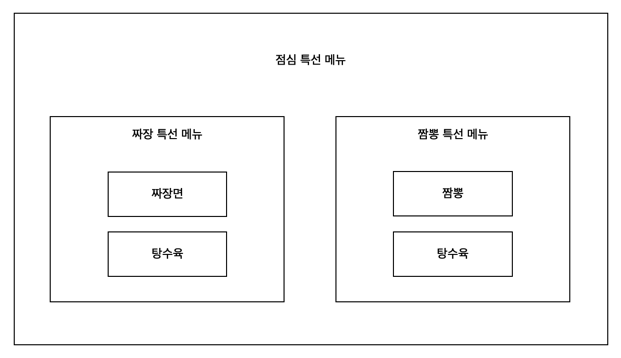

# 키친포스

## 퀵 스타트

```sh
cd docker
docker compose -p kitchenpos up -d
```

## 요구 사항

### 상품

- 상품을 등록할 수 있다.
- 상품의 가격이 올바르지 않으면 등록할 수 없다.
    - 상품의 가격은 0원 이상이어야 한다.
- 상품의 이름이 올바르지 않으면 등록할 수 없다.
    - 상품의 이름에는 비속어가 포함될 수 없다.
- 상품의 가격을 변경할 수 있다.
- 상품의 가격이 올바르지 않으면 변경할 수 없다.
    - 상품의 가격은 0원 이상이어야 한다.
- 상품의 가격이 변경될 때 메뉴의 가격이 메뉴에 속한 상품 금액의 합보다 크면 메뉴가 숨겨진다.
- 상품의 목록을 조회할 수 있다.

### 메뉴 그룹

- 메뉴 그룹을 등록할 수 있다.
- 메뉴 그룹의 이름이 올바르지 않으면 등록할 수 없다.
    - 메뉴 그룹의 이름은 비워 둘 수 없다.
- 메뉴 그룹의 목록을 조회할 수 있다.

### 메뉴

- 1 개 이상의 등록된 상품으로 메뉴를 등록할 수 있다.
- 상품이 없으면 등록할 수 없다.
- 메뉴에 속한 상품의 수량은 0 이상이어야 한다.
- 메뉴의 가격이 올바르지 않으면 등록할 수 없다.
    - 메뉴의 가격은 0원 이상이어야 한다.
- 메뉴에 속한 상품 금액의 합은 메뉴의 가격보다 크거나 같아야 한다.
- 메뉴는 특정 메뉴 그룹에 속해야 한다.
- 메뉴의 이름이 올바르지 않으면 등록할 수 없다.
    - 메뉴의 이름에는 비속어가 포함될 수 없다.
- 메뉴의 가격을 변경할 수 있다.
- 메뉴의 가격이 올바르지 않으면 변경할 수 없다.
    - 메뉴의 가격은 0원 이상이어야 한다.
- 메뉴에 속한 상품 금액의 합은 메뉴의 가격보다 크거나 같아야 한다.
- 메뉴를 노출할 수 있다.
- 메뉴의 가격이 메뉴에 속한 상품 금액의 합보다 높을 경우 메뉴를 노출할 수 없다.
- 메뉴를 숨길 수 있다.
- 메뉴의 목록을 조회할 수 있다.

### 주문 테이블

- 주문 테이블을 등록할 수 있다.
- 주문 테이블의 이름이 올바르지 않으면 등록할 수 없다.
    - 주문 테이블의 이름은 비워 둘 수 없다.
- 빈 테이블을 해지할 수 있다.
- 빈 테이블로 설정할 수 있다.
- 완료되지 않은 주문이 있는 주문 테이블은 빈 테이블로 설정할 수 없다.
- 방문한 손님 수를 변경할 수 있다.
- 방문한 손님 수가 올바르지 않으면 변경할 수 없다.
    - 방문한 손님 수는 0 이상이어야 한다.
- 빈 테이블은 방문한 손님 수를 변경할 수 없다.
- 주문 테이블의 목록을 조회할 수 있다.

### 주문

- 1개 이상의 등록된 메뉴로 배달 주문을 등록할 수 있다.
- 1개 이상의 등록된 메뉴로 포장 주문을 등록할 수 있다.
- 1개 이상의 등록된 메뉴로 매장 주문을 등록할 수 있다.
- 주문 유형이 올바르지 않으면 등록할 수 없다.
- 메뉴가 없으면 등록할 수 없다.
- 매장 주문은 주문 항목의 수량이 0 미만일 수 있다.
- 매장 주문을 제외한 주문의 경우 주문 항목의 수량은 0 이상이어야 한다.
- 배달 주소가 올바르지 않으면 배달 주문을 등록할 수 없다.
    - 배달 주소는 비워 둘 수 없다.
- 빈 테이블에는 매장 주문을 등록할 수 없다.
- 숨겨진 메뉴는 주문할 수 없다.
- 주문한 메뉴의 가격은 실제 메뉴 가격과 일치해야 한다.
- 주문을 접수한다.
- 접수 대기 중인 주문만 접수할 수 있다.
- 배달 주문을 접수되면 배달 대행사를 호출한다.
- 주문을 서빙한다.
- 접수된 주문만 서빙할 수 있다.
- 주문을 배달한다.
- 배달 주문만 배달할 수 있다.
- 서빙된 주문만 배달할 수 있다.
- 주문을 배달 완료한다.
- 배달 중인 주문만 배달 완료할 수 있다.
- 주문을 완료한다.
- 배달 주문의 경우 배달 완료된 주문만 완료할 수 있다.
- 포장 및 매장 주문의 경우 서빙된 주문만 완료할 수 있다.
- 주문 테이블의 모든 매장 주문이 완료되면 빈 테이블로 설정한다.
- 완료되지 않은 매장 주문이 있는 주문 테이블은 빈 테이블로 설정하지 않는다.
- 주문 목록을 조회할 수 있다.

## 용어 사전



### 상품

| 한글명   | 영문명            | 설명                        |
|-------|----------------|---------------------------|
| 상품    | product        | 키친포스기에 등록 될 상품을 의미한다.     |
| 상품 등록 | product create | 키친포스기가 관리 하는 상품을 등록하는 행위. |
| 상품 가격 | product price  | 키친포스기가 관리 하는 상품의 가격.      |
| 상품 이름 | product name   | 키친포스기가 관리 하는 상품의 이름.      |
| 상품 목록 | product list   | 키친포스기에서 관리 된 모든 상품의 목록.   |

### 메뉴그룹

| 한글명       | 영문명             | 설명                             |
|-----------|-----------------|--------------------------------|
| 메뉴 그룹     | menu group      | 메뉴의 묶음, 위 그림에서 점심 특선 메뉴를 의미한다. |
| 메뉴 그룹 이름  | menu group name | 메뉴 그룹의 이름.                     |
| 메뉴 그룹의 목록 | menu group list | 메뉴 그룹의 전체 목록                   |

### 메뉴

| 한글명       | 영문명                 | 설명                                                      |
|-----------|---------------------|---------------------------------------------------------|
| 메뉴        | menu                | 메뉴상품들의 묶음                                               |
| 메뉴 상품     | menu product        | 메뉴에 포함되는 상품                                             |
| 메뉴 가격     | menu price          | 메뉴의 가격                                                  |
| 메뉴의 메뉴 그룹 | menu group for menu | 메뉴가 속하는 메뉴 그룹                                           |
| 메뉴 이름     | menu name           | 메뉴의 이름                                                  |
| 비속어       | profanity           | https://www.purgomalum.com/profanitylist.html 에 포함된 단어. |
| 메뉴 노출     | display menu        | 메뉴를 사용자에게 보여주는 행위                                       |
| 메뉴 숨김     | hide menu           | 메뉴를 사용자에게 보여주지 않는 행위                                    |
| 메뉴 목록     | menu list           | 메뉴의 전체 목록.                                              |

### 주문 테이블

| 한글명        | 영문명               | 설명                                    |
|------------|-------------------|---------------------------------------|
| 주문 테이블     | order table       | 실제 매장에 위치하는 테이블을 의미한다.                |
| 주문 테이블 이름  | order table name  | 주문 테이블 이름                             |
| 빈 테이블      | empty table       | 손님이 앉아있지 않은 테이블.                      |
| 빈 테이블 설정   | table unuse       | 손님이 식사를 마치고 가계를 나가서 테이블이 비어있는 상태를 의미. |
| 빈 테이블 해지   | table use         | 손님이 자리에 앉아 있는 상태                      |
| 방문한 손님 수   | number of guests  | 하나의 테이블에 앉아있는 손님 수                    |
| 주문 테이블 목록  | order table list  | 주문 테이블의 전체 목록.                        |
| 완료되지 않은 주문 | uncompleted order | 완료되지 않은 매장 주문                         |

### 주문

| 한글명     | 영문명              | 설명                                                                                                |
|---------|------------------|---------------------------------------------------------------------------------------------------|
| 주문      | order            | 고객의 1개 이상의 메뉴 구매 요청                                                                               |
| 메뉴      | menu             | 주문의 최소 단위                                                                                         |
| 주문 유형   | order type       | 주문의 유형으로 배달 주문, 포장 주문, 매장 주문 이 있다.                                                                |
| 주문 항목   | orderLineItem    | 주문한 메뉴의 종류와 수량의 정보.                                                                               |
| 대기중인 주문 | waiting order    | 주문은 되었으나 접수되지 않은 주문                                                                               |
| 접수된 주문  | accepted order   | 사장님이 수락한 주문                                                                                       |
| 서빙된 주문  | served order     | 조리가 완료 되고 서빙 담당자에게 음식이 전달된 상태. (포장 주문이면 손님에게 전달 됨, 배달 주문이면 기사에게 전달 됨, 매장 주문이면 테이블에 앉은 손님에게 전달 됨.) |
| 배달중인 주문 | delivering order | 배달기사가 손님에게 배달중인 상태.                                                                               |
| 배달 된 주문 | delivered order  | 배달기다가 손님에게 음식을 전달한 상태.                                                                            |
| 완료 된 주문 | completed order  | 손님에게 음식이 완전히 전달된 상태                                                                               |
| 주문 목록   | order list       | 주문의 전체 목록                                                                                         |

## 모델링
