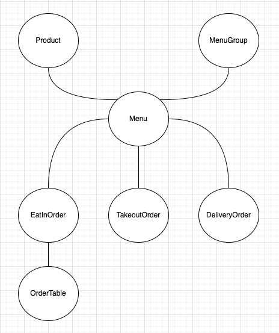

# 키친포스

## 퀵 스타트

```sh
cd docker
docker compose -p kitchenpos up -d
```

## 요구 사항

### 상품

- 상품을 등록할 수 있다.
- 상품의 가격이 올바르지 않으면 등록할 수 없다.
    - 상품의 가격은 0원 이상이어야 한다.
- 상품의 이름이 올바르지 않으면 등록할 수 없다.
    - 상품의 이름에는 비속어가 포함될 수 없다.
- 상품의 가격을 변경할 수 있다.
- 상품의 가격이 올바르지 않으면 변경할 수 없다.
    - 상품의 가격은 0원 이상이어야 한다.
- 상품의 가격이 변경될 때 메뉴의 가격이 메뉴에 속한 상품 금액의 합보다 크면 메뉴가 숨겨진다.
- 상품의 목록을 조회할 수 있다.

### 메뉴 그룹

- 메뉴 그룹을 등록할 수 있다.
- 메뉴 그룹의 이름이 올바르지 않으면 등록할 수 없다.
    - 메뉴 그룹의 이름은 비워 둘 수 없다.
- 메뉴 그룹의 목록을 조회할 수 있다.

### 메뉴

- 1 개 이상의 등록된 상품으로 메뉴를 등록할 수 있다.
- 상품이 없으면 등록할 수 없다.
- 메뉴에 속한 상품의 수량은 0 이상이어야 한다.
- 메뉴의 가격이 올바르지 않으면 등록할 수 없다.
    - 메뉴의 가격은 0원 이상이어야 한다.
- 메뉴에 속한 상품 금액의 합은 메뉴의 가격보다 크거나 같아야 한다.
- 메뉴는 특정 메뉴 그룹에 속해야 한다.
- 메뉴의 이름이 올바르지 않으면 등록할 수 없다.
    - 메뉴의 이름에는 비속어가 포함될 수 없다.
- 메뉴의 가격을 변경할 수 있다.
- 메뉴의 가격이 올바르지 않으면 변경할 수 없다.
    - 메뉴의 가격은 0원 이상이어야 한다.
- 메뉴에 속한 상품 금액의 합은 메뉴의 가격보다 크거나 같아야 한다.
- 메뉴를 노출할 수 있다.
- 메뉴의 가격이 메뉴에 속한 상품 금액의 합보다 높을 경우 메뉴를 노출할 수 없다.
- 메뉴를 숨길 수 있다.
- 메뉴의 목록을 조회할 수 있다.

### 주문 테이블

- 주문 테이블을 등록할 수 있다.
- 주문 테이블의 이름이 올바르지 않으면 등록할 수 없다.
    - 주문 테이블의 이름은 비워 둘 수 없다.
- 빈 테이블을 해지할 수 있다.
- 빈 테이블로 설정할 수 있다.
- 완료되지 않은 주문이 있는 주문 테이블은 빈 테이블로 설정할 수 없다.
- 방문한 손님 수를 변경할 수 있다.
- 방문한 손님 수가 올바르지 않으면 변경할 수 없다.
    - 방문한 손님 수는 0 이상이어야 한다.
- 빈 테이블은 방문한 손님 수를 변경할 수 없다.
- 주문 테이블의 목록을 조회할 수 있다.

### 주문

- 1개 이상의 등록된 메뉴로 배달 주문을 등록할 수 있다.
- 1개 이상의 등록된 메뉴로 포장 주문을 등록할 수 있다.
- 1개 이상의 등록된 메뉴로 매장 주문을 등록할 수 있다.
- 주문 유형이 올바르지 않으면 등록할 수 없다.
- 메뉴가 없으면 등록할 수 없다.
- 매장 주문은 주문 항목의 수량이 0 미만일 수 있다.
- 매장 주문을 제외한 주문의 경우 주문 항목의 수량은 0 이상이어야 한다.
- 배달 주소가 올바르지 않으면 배달 주문을 등록할 수 없다.
    - 배달 주소는 비워 둘 수 없다.
- 빈 테이블에는 매장 주문을 등록할 수 없다.
- 숨겨진 메뉴는 주문할 수 없다.
- 주문한 메뉴의 가격은 실제 메뉴 가격과 일치해야 한다.
- 주문을 접수한다.
- 접수 대기 중인 주문만 접수할 수 있다.
- 배달 주문을 접수되면 배달 대행사를 호출한다.
- 주문을 서빙한다.
- 접수된 주문만 서빙할 수 있다.
- 주문을 배달한다.
- 배달 주문만 배달할 수 있다.
- 서빙된 주문만 배달할 수 있다.
- 주문을 배달 완료한다.
- 배달 중인 주문만 배달 완료할 수 있다.
- 주문을 완료한다.
- 배달 주문의 경우 배달 완료된 주문만 완료할 수 있다.
- 포장 및 매장 주문의 경우 서빙된 주문만 완료할 수 있다.
- 주문 테이블의 모든 매장 주문이 완료되면 빈 테이블로 설정한다.
- 완료되지 않은 매장 주문이 있는 주문 테이블은 빈 테이블로 설정하지 않는다.
- 주문 목록을 조회할 수 있다.

## 용어 사전

### 상품
상품 context

| 한글명 | 영문명          | 설명 |
|---|--------------| --- |
| 상품 | Product      | 판매하려는 제품. 상품이름과 상품가격으로 구성되어 있다. |
| 상품이름 | ProductName  | 상품의 이름 |
| 상품가격 | ProductPrice | 상품의 가격 |

### 메뉴그룹
메뉴그룹 context

| 한글명 | 영문명 | 설명 |
|---| --- | --- |
| 메뉴그룹 | MenuGroup | 카테고리, 메뉴들의 묶음. 비슷한 메뉴들을 묶어서 손님들이 원하는 메뉴를 찾기 쉽게 하거나, 인기메뉴와 같이 손님에게 어필하고 싶은 메뉴들을 노출하는 용도로도 사용이 가능하다. |
| 메뉴그룹이름 | MemuGroupName | 메뉴그룹의 이름 <br/>e.g. 인기메뉴, 시즌메뉴, 특가메뉴, 한마리치킨메뉴 등 |

### 메뉴
메뉴 context

| 한글명      | 영문명               | 설명                                                                                                                                                                                           |
|----------|-------------------|----------------------------------------------------------------------------------------------------------------------------------------------------------------------------------------------|
| 메뉴       | Menu              | 하나 이상의 상품들의 묶음으로 손님에게 판매할 수 있는 최소 단위. <br/>메뉴는 이름, 가격, 메뉴그룹, 구성상품목록으로 구성되어 있다. <br/>e.g.) '후라이드치킨'메뉴 = 후라이드치킨1개, '반반치킨'메뉴 = 후라이드치킨 1개, 양념치킨 1개                                               |
| 구성상품목록   | MenuProducts      | 상품과 상품개수로 구성된 목록                                                                                                                                                                             |
| 메뉴가격     | MenuPrice         | 메뉴의 금액.                                                                                                                                                                                      |
| 메뉴이름     | MenuName         | 메뉴의 이름.                                                                                                                                                                                      |
| 노출하다     | display           | 판매하려는 메뉴(숨겨진 메뉴)를 손님에게 공개하는 행위.                                                                                                                                                              |
| 숨기다      | hide              | 손님이 주문할 수 없도록 노출된 메뉴를 감추는 행위.                                                                                                                                                                |
| 메뉴구성상품 금액의 합 | TotalProductPrice | 메뉴에 포함된 상품들의 수량 * 가격의 총합. <br/>예를 들어 '패밀리세트'라는 메뉴가 '후라이드(5,000원)' 두마리, '콜라(1000)' 1개로 되어 있다면, 메뉴에 속한 상품 금액의 합은 11,000원이 된다. (5000*2 + 1000) |

### 주문테이블
주문테이블 context

| 한글명 | 영문명            | 설명 |
|---|----------------| --- |
| 주문 테이블 | orderTable     | 매장에 있는 테이블. 손님들이 이용할 수 있다. <br/> * 이름, 이용손님 수, 사용여부로 구성되어 있다. |
| 빈 테이블 | emptyTable     | 손님이 사용하고 있지 않은 테이블. |
| 빈 테이블 해지 | sit            | 손님들이 테이블에 착석한 경우, 해당 테이블을 '이용중'상태로 변경하는 행위. |
| 빈 테이블 설정 | clear          | 사용이 끝난 테이블을 빈 테이블로 변경하는 행위. 빈 테이블 상태로 변경하고, 방문한 손님 수를 0으로 설정한다. |
| 방문한 손님 수 | numberOfGuests | 테이블에 착석한 손님 수. |

### 매장주문
매장주문 context

| 한글명 | 영문명             | 설명                                                                        |
|---|-----------------|---------------------------------------------------------------------------|
| 매장주문 | EatInOrder      | 주문한 음식을 매장에서 먹는 유형의 주문  <br/> * 주문상태, 주문일시, 주문테이블, 주문메뉴정보로 구성되어 있다. |
| 주문메뉴정보 | EatInOrderMenus | 주문한 메뉴들의 정보. 상품과 수량.                                                      |
| 주문상태 | EatInOrderStatus     | 주문의 진행상태. <br/> * 접수대기, 접수, 서빙완료, 주문완료로 구분한다.                             |
| 접수대기 | waiting         | 등록한 주문의 최초 상태.                                                            |
| 접수 | accepted        | 주문을 확인하고, 조리를 시작한 상태.                                                     |
| 서빙완료 | served          | 조리 완료된 주문을 손님에게 전달 가능한 상태.<br/> * 조리완료된 음식을 주문테이블에 갖다준 상태.                |
| 주문완료 | completed       | 주문이 완료된 상태. 손님이 식사를 마친상태.                                                 |
| 주문금액 | orderPrice      | 주문에 포함된 메뉴들의 금액의 총 합.                                                     |
| 주문접수 | accept          | 들어온 주문을 확인하고 조리를 시작하는 행위.                                                 |
| 서빙 | serve           | 조리완료된 음식을 손님에게 전달하는 행위.                                                   |

### 포장주문
포장주문 context

| 한글명 | 영문명         | 설명                                                                        |
|---|-------------|---------------------------------------------------------------------------|
| 포장주문 | TakeoutOrder   | 주문한 음식을 매장에 방문해서 가저가는 유형의 주문   <br/> * 주문유형, 주문상태, 주문일시, 주문메뉴정보로 구성되어 있다. |
| 주문메뉴정보 | TakeoutOrderMenus | 주문한 메뉴들의 정보. 상품과 수량.                                                      |
| 주문상태 | TakeoutOrderStatus | 주문의 진행상태. <br/> * 접수대기, 접수, 포장완료, 주문완료로 구분한다.                             |
| 접수대기 | waiting     | 등록한 주문의 최초 상태.                                                            |
| 접수 | accepted    | 주문을 확인하고, 조리를 시작한 상태.                                                     |
| 포장완료 | packed      | 조리완료된 음식을 포장한 상태.                                                         |
| 주문완료 | completed   | 고객이 음식을 픽업한 상태. 요청받은 주문에 대한 처리를 완료한 상태.                                   |
| 주문금액 | orderPrice  | 주문에 포함된 메뉴들의 금액의 총 합.                                                     |
| 주문접수 | accept      | 들어온 주문을 확인하고 조리를 시작하는 행위.                                                 |
| 포장 | packed      | 조리완료된 음식을 포장하는 행위.                                                        |

### 배달주문
배달주문 context

| 한글명 | 영문명                 | 설명                                                                               |
|---|---------------------|----------------------------------------------------------------------------------|
| 배달주문 | DeliveryOrder       | 주문한 음식을 손님이 있는 곳으로 배달하는 유형의 주문  <br/> * 주문유형, 주문상태, 주문일시, 배달주소, 주문메뉴정보로 구성되어 있다. |
| 주문메뉴정보 | DeliveryOrderMenus  | 주문한 메뉴들의 정보. 상품과 수량.                                                      |
| 주문상태 | DeliveryOrderStatus | 주문의 진행상태. <br/> * 접수대기, 접수, 포장완료, 배달중, 배달완료, 주문완료로 구분한다.                         |
| 접수대기 | waiting             | 등록한 주문의 최초 상태.                                                                   |
| 접수 | accepted            | 주문을 확인하고, 조리를 시작한 상태.                                                            |
| 포장완료 | packed              | 조리완료된 음식을 포장한 상태.                                                                |
| 배달중 | delivering          | 배달대행사에서 조리완료된 음식을 픽업한 상태.                                                        |
| 배달완료 | delivered           | 손님이 음식을 받은 상태.                                                                   |
| 주문완료 | completed           | 주문이 완료된 상태. 요청받은 주문에 대한 처리를 완료한 상태.                                              |
| 주문금액 | orderPrice          | 주문에 포함된 메뉴들의 금액의 총 합.                                                            |
| 주문접수 | accept              | 들어온 주문을 확인하고 조리를 시작하는 행위.                                                        |
| 포장 | packed              | 조리완료된 음식을 포장하는 행위.                                                               |
| 배달주소 | DeliveryAddress     | 음식을 배달해야하는 목적지.                                                                  |
| 배달 대행사 | kitchenRiders       | 배달주문음식을 손님에게 전달해주는 업체                                                            |
| 배달요청 | requestDelivery     | 배달대행사에게 배달을 요청하는 행위. 주문번호, 주문금액, 배달주소를 전달한다.                                     |

## 모델링
### ContextMap


### 상품
- `Product`는 상품이름을 표현하는 `ProductName`를 갖는다.
- `ProductName`에서 올바른 상품이름인지 판단한다.
- `Product`는 상품가격을 표현하는 `ProductPrice`를 갖는다.
- `ProductPrice`에서 올바른 상품 가격인지 판단한다.

### 메뉴그룹
- `MenuGroup`은 메뉴그룹이름을 표현하는 `MenuGroupName`을 갖는다.
- `MenuGroupName`에서 올바른 메뉴그룹이름인지 판단한다.

### 메뉴
- `Menu`는 메뉴이름을 표현하는 `MenuName`을 갖는다.
- `MenuName`에서 메뉴이름을 사용할 수 있는지 판단한다.
- `Menu`는 메뉴가격을 표현하는 `MenuPrice`를 갖는다.
- `MenuPrice`에서 올바른 메뉴가격인지 판단한다.
- `Menu`는 구성상품 목록을 표현하는 `MenuProducts`를 갖는다.
- `MenuProducts`에서 올바른 메뉴구성품 정보인지 판단한다.
- `MenuDisplayChangeCondition`에서 메뉴를 노출할 수 있는지 판단한다. 

### 주문테이블
- `OrderTable`은 주문테이블 이름을 표현하는 `OrderTableName`을 갖는다.
- `OrderTableName`에서 올바른 주문테이블 이름인지 판단한다.
- `OrderTable`은 방문한 손님 수를 표현하는 `NumberOfGuests`를 갖는다.
- `NumberOfGuests`에서 올바른 방문한 손님 수 인지 판단한다.
- `OrderTableClearCondition`에서 빈 테이블로 변경할 수 있는지 판단한다.

### 매장주문
- `EatInOrder`는 주문상태를 구분하는 `EatInOrderStatus`를 갖는다.
- `EatInOrder`는 주문한 메뉴들을 표현하는 `EatInOrderMenus`를 갖는다.
- `EatInOrderMenus`에서 주문이 가능한 메뉴들인지 판단한다.

### 포장주문
- `TakeoutOrder`는 주문상태를 구분하는 `TakeoutOrderStatus`를 갖는다.
- `TakeoutOrder`는 주문메뉴정보를 표현하는 `TakeoutOrderMenus`를 갖는다.
- `TakeoutOrderMenus`에서 주문이 가능한 메뉴들인지 판단한다.

### 배달주문
- `DeliveryOrder`는 주문상태를 구분하는 `DeliveryOrderStatus`를 갖는다.
- `DeliveryOrder`는 주문한 메뉴들을 표현하는 `DeliveryOrderMenus`를 갖는다.
- `DeliveryOrderMenus`에서 주문이 가능한 메뉴들인지 판단한다.
- `DeliveryOrder`는 배달주문을 표현하는 `DeliveryAddress`를 갖는다.
- `DeliveryAddress`에서 올바른 배달주소인지 판단한다.