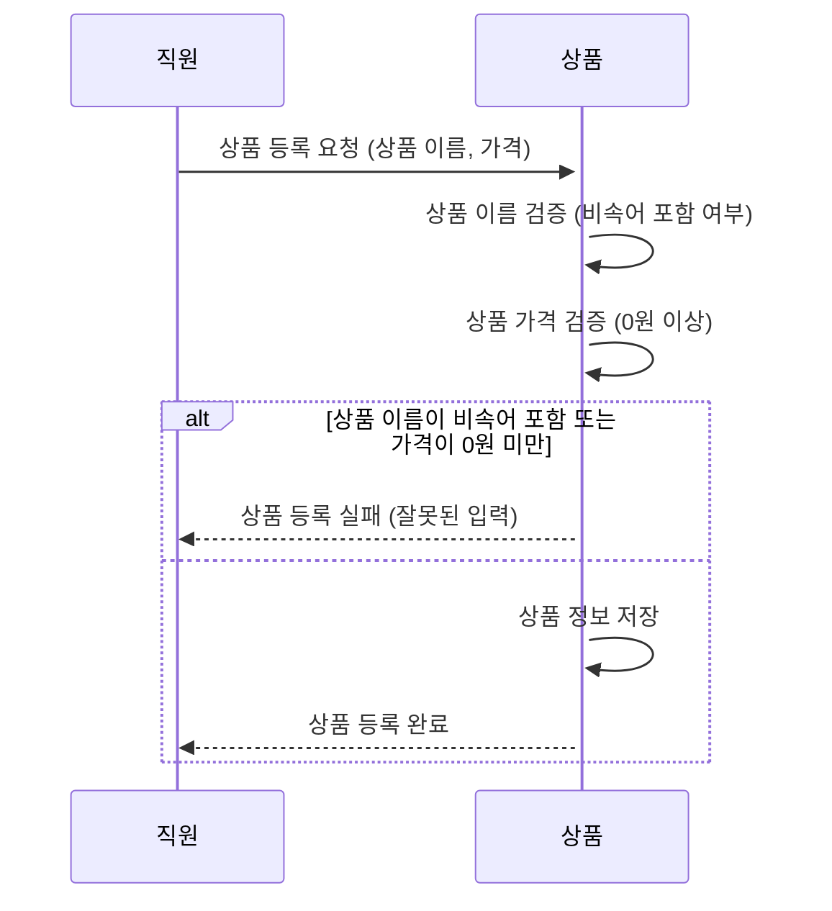

# 키친포스

## 퀵 스타트

```sh
cd docker
docker compose -p kitchenpos up -d
```

## 요구 사항

### 상품

- 상품을 등록할 수 있다.
- 상품의 가격이 올바르지 않으면 등록할 수 없다.
    - 상품의 가격은 0원 이상이어야 한다.
- 상품의 이름이 올바르지 않으면 등록할 수 없다.
    - 상품의 이름에는 비속어가 포함될 수 없다.
- 상품의 가격을 변경할 수 있다.
- 상품의 가격이 올바르지 않으면 변경할 수 없다.
    - 상품의 가격은 0원 이상이어야 한다.
- 상품의 가격이 변경될 때 메뉴의 가격이 메뉴에 속한 상품 금액의 합보다 크면 메뉴가 숨겨진다.
- 상품의 목록을 조회할 수 있다.

### 메뉴 그룹

- 메뉴 그룹을 등록할 수 있다.
- 메뉴 그룹의 이름이 올바르지 않으면 등록할 수 없다.
    - 메뉴 그룹의 이름은 비워 둘 수 없다.
- 메뉴 그룹의 목록을 조회할 수 있다.

### 메뉴

- 1 개 이상의 등록된 상품으로 메뉴를 등록할 수 있다.
- 상품이 없으면 등록할 수 없다.
- 메뉴에 속한 상품의 수량은 0 이상이어야 한다.
- 메뉴의 가격이 올바르지 않으면 등록할 수 없다.
    - 메뉴의 가격은 0원 이상이어야 한다.
- 메뉴에 속한 상품 금액의 합은 메뉴의 가격보다 크거나 같아야 한다.
- 메뉴는 특정 메뉴 그룹에 속해야 한다.
- 메뉴의 이름이 올바르지 않으면 등록할 수 없다.
    - 메뉴의 이름에는 비속어가 포함될 수 없다.
- 메뉴의 가격을 변경할 수 있다.
- 메뉴의 가격이 올바르지 않으면 변경할 수 없다.
    - 메뉴의 가격은 0원 이상이어야 한다.
- 메뉴에 속한 상품 금액의 합은 메뉴의 가격보다 크거나 같아야 한다.
- 메뉴를 노출할 수 있다.
- 메뉴의 가격이 메뉴에 속한 상품 금액의 합보다 높을 경우 메뉴를 노출할 수 없다.
- 메뉴를 숨길 수 있다.
- 메뉴의 목록을 조회할 수 있다.

### 주문 테이블

- 주문 테이블을 등록할 수 있다.
- 주문 테이블의 이름이 올바르지 않으면 등록할 수 없다.
    - 주문 테이블의 이름은 비워 둘 수 없다.
- 빈 테이블을 해지할 수 있다.
- 빈 테이블로 설정할 수 있다.
- 완료되지 않은 주문이 있는 주문 테이블은 빈 테이블로 설정할 수 없다.
- 방문한 손님 수를 변경할 수 있다.
- 방문한 손님 수가 올바르지 않으면 변경할 수 없다.
    - 방문한 손님 수는 0 이상이어야 한다.
- 빈 테이블은 방문한 손님 수를 변경할 수 없다.
- 주문 테이블의 목록을 조회할 수 있다.

### 주문

- 1개 이상의 등록된 메뉴로 배달 주문을 등록할 수 있다.
- 1개 이상의 등록된 메뉴로 포장 주문을 등록할 수 있다.
- 1개 이상의 등록된 메뉴로 매장 주문을 등록할 수 있다.
- 주문 유형이 올바르지 않으면 등록할 수 없다.
- 메뉴가 없으면 등록할 수 없다.
- 매장 주문은 주문 항목의 수량이 0 미만일 수 있다.
- 매장 주문을 제외한 주문의 경우 주문 항목의 수량은 0 이상이어야 한다.
- 배달 주소가 올바르지 않으면 배달 주문을 등록할 수 없다.
    - 배달 주소는 비워 둘 수 없다.
- 빈 테이블에는 매장 주문을 등록할 수 없다.
- 숨겨진 메뉴는 주문할 수 없다.
- 주문한 메뉴의 가격은 실제 메뉴 가격과 일치해야 한다.
- 주문을 접수한다.
- 접수 대기 중인 주문만 접수할 수 있다.
- 배달 주문을 접수되면 배달 대행사를 호출한다.
- 주문을 서빙한다.
- 접수된 주문만 서빙할 수 있다.
- 주문을 배달한다.
- 배달 주문만 배달할 수 있다.
- 서빙된 주문만 배달할 수 있다.
- 주문을 배달 완료한다.
- 배달 중인 주문만 배달 완료할 수 있다.
- 주문을 완료한다.
- 배달 주문의 경우 배달 완료된 주문만 완료할 수 있다.
- 포장 및 매장 주문의 경우 서빙된 주문만 완료할 수 있다.
- 주문 테이블의 모든 매장 주문이 완료되면 빈 테이블로 설정한다.
- 완료되지 않은 매장 주문이 있는 주문 테이블은 빈 테이블로 설정하지 않는다.
- 주문 목록을 조회할 수 있다.

## 용어 사전


### 상품 (product)
| 한글 명        | 영문 명                 | 설명        
|-------------|----------------------|-----------
| 상품          | product              | 판매할 수 있는 개별 `상품`|
| 상품 가격       | product price        | `상품`의 가격을 설정하는 기능|
| 상품 이름       | product name         | `상품`의 고유한 이름|
| 상품 목록       | product list         |등록된 `상품`들의 전체 목록|
| 상품 등록하기     | create product       |새로운 `상품`을 등록하는 기능|
| 상품 가격 변경하기  | change product price |기존 `상품`의 가격을 수정하는 기능|
| 상품 목록 조회하기  | find product list      |등록된 상품 목록을 조회하는 기능|

### 메뉴 그룹 (menu group)
| 한글명           | 영문명                  | 설명                  |
|---------------|----------------------|---------------------|
| 메뉴 그룹         | menu group           | 메뉴를 분류하는 그룹         |
| 메뉴 그룹 명       | menu group name | `메뉴 그룹`의 이름           |
| 메뉴 그룹 목록      | menu group list | 등록된 `메뉴 그룹`들의 전체 목록 |
| 메뉴 그룹 목록 조회하기 | find menu group list | 등록된 `메뉴 그룹` 목록을 조회하는 기능 |
| 메뉴 그룹 등록하기    | create menu group    | 새로운 `메뉴 그룹`을 등록하는 기능  |


### 메뉴 (menu)
| 한글명        | 영문명               | 설명                       |
|------------|-------------------|--------------------------|
| 메뉴         | menu              | 하나 이상의 상품으로 구성된 주문 가능한 항목 |
| 메뉴 상품      | menu proudct      | `메뉴`에 포함된 개별 상품          |
| 메뉴 가격      | menu price        | `메뉴`의 판매 가격 (0원 이상)      |
| 메뉴 이름      | menu name         | `메뉴`의 고유한 이름 (비속어 포함 불가) |
| 메뉴 목록      | menu list         | 등록된 `메뉴`들의 전체 목록         |
| 메뉴 등록      | create menu       | 새로운 `메뉴`를 등록하는 기능        |
| 메뉴 목록 조회하기 | find menu list    | 등록된 `메뉴` 목록을 조회하는 기능     |
| 메뉴 가격 변경하기 | change menu price | 기존 `메뉴`의 가격을 수정하는 기능      |
| 메뉴 노출하기    | display menu      | 고객이 `메뉴`를 볼 수 있도록 설정하는 기능  |
| 메뉴 숨기기     | hide menu         | 고객이 `메뉴`를 볼 수 없도록 설정하는 기능  |


### 주문 테이블 (order table)
| 한글명            | 영문명                     | 설명                            |
|----------------|-------------------------|-------------------------------|
| 주문 테이블         | order table             | 매장 내에서 고객이 식사하는 `테이블`|
| 주문 테이블 이름      | order table name        | `주문 테이블`의 고유한 이름 (비워 둘 수 없음)|
| 방문 손님 수        | number of guests        | `주문 테이블`에 앉은 손님 수 (0 이상)|
| 주문 테이블 목록      | order table list        | 등록된 `주문 테이블`들의 전체 목록|
| 주문 테이블 등록하기    | create order table      | 새로운 `주문 테이블`을 등록하는 기능|
| 빈 테이블에 앉기      | sit order table         | 빈 `테이블`을 해지하는 기능 (손님이 테이블에 앉은 상태)|
| 주문 테이블 치우기     | clear order table       | 빈 `테이블`로 설정하는 기능 (손님이 테이블에 없는 상태)|
| 방문 손님 수 변경하기   | change number of guests | `주문 테이`블의 방문한 손님 수를 수정하는 기능|
| 주문 테이블 목록 조회하기 | find order table list   | 등록된 `주문 테이블` 목록을 조회하는 기능|


### 주문 (order)
| 한글명         | 영문명             | 설명                                        |
|-------------|-----------------|-------------------------------------------|
| 주문          | order           | 손님이 하나 이상의 메뉴 목록을 제공받기 위해 요청하는 것          |
| 주문 타입       | order type      | 주문의 방식 (배달, 포장, 매장 주문)                    |
| 주문 상태       | order status    | 주문의 진행 상태 (대기, 수락됨, 제공됨, 배달 중, 배달 완료, 완료) |
| 주문 목록       | order list      | 등록된 주문들의 전체 목록                            |
| 주문 목록 조회하기  | find order list | 등록된 주문 목록을 조회하는 기능                        |
| 주문 항목       | order item           | 고객이 메뉴를 선택 후 `주문`한 내역                     |


### 배달 주문 (delivery)
| 한글명         | 영문명             | 설명                                        |
|-------------|-----------------|-------------------------------------------|
| 배달          | delivery | `배달(배달대행사 호출)`로 주문한 경우 |
| 배달 주문       | delivery order       | `배달대행사(라이더)`에게 메뉴를 제공받기위한 `주문 유형` 중 하나    |
| 배달 대행사      | delivery agency      | 배달 대행 업체                                  |
| 배달 대행사 호출하기 | call delivery agency | 배달 대행 업체의 라이더 호출                          |
| 배달 주소       | delivery address     | 라이더가 배달 해야될 고객의 `배달지 주소`                  |
| 배달 중        | delivering | 서빙/제공완료 후 배달중 상태       |
| 배달완료        | delivered  | 배달중 이후 배달완료 상태         |


### 포장 주문 (take out)
| 한글명         | 영문명            | 설명                                        |
|-------------|----------------|-------------------------------------------|
| 포장   | take out       | `포장`으로 주문할 경우          |
| 포장 주문       | take out order | `고객이 직접 메뉴를 수령`하기위한 `주문 유형` 중의 하나         |

### 먹고 가기 (eat in)
| 한글명         | 영문명             | 설명                                        |
|-------------|-----------------|-------------------------------------------|
| 매장 주문       | table order          | `먹고가기`를 하기위한 `주문 유형` 중 하나        |
| 먹고가기 | eat in   | `매장 식사`로 주문할 경우        |
| 대기    | waiting    | 주문 요청상태 (주문 등록 후 대기상태) |
| 수락    | accepted   | 주문 요청 후 수락상태           |
| 서빙/제공 | served     | 주문 수락 후 서빙/제공완료 상태     |


## 모델링

## `상품 (product)`
- `상품(product)`은 `상품 가격(product price)`, `상품 이름(product name)`을 가진다.
- `상품 가격(product price)`은 0원 이상이어야 한다.
- `상품 이름(product name)`에는 비속어가 포함될 수 없다.
- `상품 목록(find product list)`을 조회할 수 있다.

### `상품 등록하기(create product)` 정책
- `상품 가격(product price)`이 0원 이상이고, `상품 이름(product name)`에 비속어가 포함되지 않은 경우 상품(product)을 등록할 수 있다.

### `상품 가격 변경하기(change product price)` 정책
- `상품 가격(product price)`이 0원 이상인 경우에만 변경할 수 있다.
- 가격 변경 후 `메뉴 가격(menu price)`이 `메뉴 상품(menu product)` 금액의 합보다 높으면 `메뉴(menu)`가 숨겨진다.

---

## `메뉴 그룹 (menu group)`
- `메뉴 그룹(menu group)`은 여러 개의 `메뉴(menu)`를 포함한다.
- `메뉴 그룹 목록(find menu group list)`을 조회할 수 있다.

### `메뉴 그룹 등록하기(create menu group)` 정책
- `메뉴 그룹 이름(menu group name)`이 비어 있지 않은 경우 `메뉴 그룹(menu group)`을 등록할 수 있다.

---

## `메뉴 (menu)`
- `메뉴(menu)`는 `메뉴 가격(menu price)`, `메뉴 상품(menu product)`, `메뉴 그룹(menu group)`, `메뉴 노출 상태(display menu)`를 가진다.
- `메뉴 가격(menu price)`은 0원 이상이어야 한다.
- `메뉴 목록(find menu list)`을 조회할 수 있다.

### `메뉴 등록하기(create menu)` 정책
- 하나 이상의 `상품(product)`이 포함된 경우에만 `메뉴(menu)`를 등록할 수 있다.
- `메뉴 가격(menu price)`이 `메뉴 상품(menu product)` 가격 합보다 크거나 같아야 등록이 가능하다.

### `메뉴 가격 변경하기(change menu price)` 정책
- `메뉴 가격(menu price)`이 0원 이상인 경우에만 변경할 수 있다.
- 변경된 가격이 `메뉴 상품(menu product)` 가격 합보다 크지 않아야 한다.

### `메뉴 노출하기(display menu)` 정책
- `메뉴 가격(menu price)`이 `메뉴 상품(menu product)` 가격 합보다 높은 경우 `메뉴(menu)`가 숨겨진다.
- `메뉴(menu)`를 고객이 볼 수 있도록 설정할 수 있다.

### `메뉴 숨기기(hide menu)` 정책
- `메뉴(menu)`를 고객이 볼 수 없도록 설정할 수 있다.

---

## `주문 테이블 (order table)`
- `주문 테이블(order table)`은 `주문 테이블 상태(order table status)`, `방문 손님 수(number of guests)`를 가진다.
- `방문 손님 수(number of guests)`는 0 이상이어야 한다.
- `주문 테이블 목록(find order table list)`을 조회할 수 있다.

### `주문 테이블 등록하기(create order table)` 정책
- `주문 테이블 이름(order table name)`이 비어 있지 않은 경우 `주문 테이블(order table)`을 등록할 수 있다.

### `빈 테이블에 앉기(sit order table)` 정책
- `주문 테이블(order table)`을 사용 중 상태로 변경할 수 있다.

### `주문 테이블 치우기(clear order table)` 정책
- 완료되지 않은 `주문(order)`이 있는 경우 `주문 테이블 치우기(clear order table)`로 설정할 수 없다.

### `방문 손님 수 변경하기(change number of guests)` 정책
- `방문 손님 수(number of guests)`가 0 이상인 경우에만 변경할 수 있다.

---

## `주문 (order)`
- `주문(order)`은 `주문 유형(order type)`, `주문 상태(order status)`, `주문 항목(order item)`을 가진다.
- `주문 목록(find order list)`을 조회할 수 있다.

### `주문 등록(create order)`하기 정책
- 하나 이상의 `메뉴(menu)`가 포함된 경우에만 `주문(order)`을 등록할 수 있다.
- `숨겨진 메뉴(hide menu)`를 주문할 수 없다.

### 주문 상태 (order status) 변경 정책
- `대기(waiting)` 상태의 주문만 `주문 수락(accepted)`할 수 있다.
- `주문 수락(accepted)`된 주문만 `주문 제공(served)`할 수 있다.
- `주문 제공(served)`된 주문만 `배달 중(delivering)`으로 변경할 수 있다.
- `배달 중(delivering)`인 주문만 `배달 완료(delivered)`할 수 있다.
- `배달 완료(delivered)`된 주문만 `주문 완료(completed)`할 수 있다.
- `포장 주문(take out order)` 및 `매장 주문(table order)`의 경우 `주문 제공(served)`된 주문만 `주문 완료(completed)`할 수 있다.

---

## `주문 유형 (order type)`

### `배달 주문 (delivery order)`
- `배달 주문(delivery order)`은 `배달 주소(delivery address)`를 가진다.
- `배달 대행사 호출하기(call delivery agency)`를 통해 배달을 요청할 수 있다.
- `배달 주소(delivery address)`는 비워 둘 수 없다.

### `포장 주문 (takeout order)`

### `매장 주문 (table order)`
- `매장 주문(table order)`은 `주문 테이블(order table)`을 가진다.
- `주문 테이블 상태(order table status)`가 사용 중이어야 한다.



```mermaid
sequenceDiagram
    participant 직원 as 직원
    participant 상품 as 상품

    직원->>+상품: 상품 등록 요청 (상품 이름, 가격)
    상품->>상품: 상품 이름 검증 (비속어 포함 여부)
    상품->>상품: 상품 가격 검증 (0원 이상)
    
    alt 상품 이름이 비속어 포함 또는 가격이 0원 미만
        상품-->>직원: 상품 등록 실패 (잘못된 입력)
    else
        상품->>+상품: 상품 정보 저장
        상품-->>직원: 상품 등록 완료
    end
```
------------
```mermaid
sequenceDiagram  
 participant 고객 as 고객  
 participant 주문 as 주문   
 participant 직원 as 직원  
 participant 배달대행 as 배달 대행사  

 고객->>+주문: 주문 요청 (메뉴 선택, 배달/포장/매장)  
 주문-->>고객: 주문 대기 상태  
  
 직원->>+주문: 주문 수락 (accepted)  
 주문-->>고객: 주문 수락  
  
 직원->>+주문: 주문 제공 (served)  
 주문-->>고객: 주문 제공  
  
 주문-->>배달대행: 배달 요청  
 배달대행-->>주문: 배달 중 (delivering)  
 배달대행->>+주문: 배달 완료 (delivered)  
 주문-->>고객: 주문 배달 완료  

 고객->>+주문: 주문 완료  
 주문-->>고객: 주문 완료
 ```
