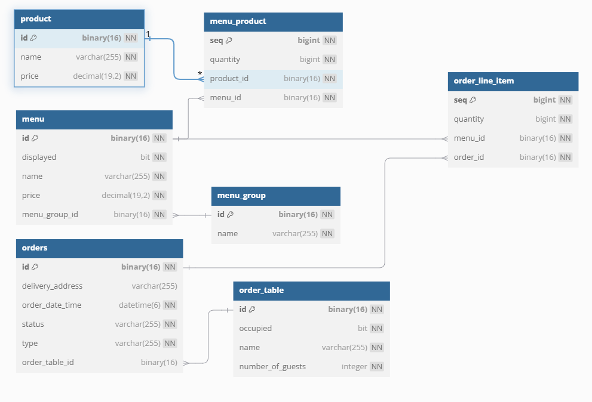

# 키친포스

## 퀵 스타트

```sh
cd docker
docker compose -p kitchenpos up -d
```

## 요구 사항

### 상품

- 상품을 등록할 수 있다.
- 상품의 가격이 올바르지 않으면 등록할 수 없다.
    - 상품의 가격은 0원 이상이어야 한다.
- 상품의 이름이 올바르지 않으면 등록할 수 없다.
    - 상품의 이름에는 비속어가 포함될 수 없다.
- 상품의 가격을 변경할 수 있다.
- 상품의 가격이 올바르지 않으면 변경할 수 없다.
    - 상품의 가격은 0원 이상이어야 한다.
- 상품의 가격이 변경될 때 메뉴의 가격이 메뉴에 속한 상품 금액의 합보다 크면 메뉴가 숨겨진다.
- 상품의 목록을 조회할 수 있다.

### 메뉴 그룹

- 메뉴 그룹을 등록할 수 있다.
- 메뉴 그룹의 이름이 올바르지 않으면 등록할 수 없다.
    - 메뉴 그룹의 이름은 비워 둘 수 없다.
- 메뉴 그룹의 목록을 조회할 수 있다.

### 메뉴

- 1 개 이상의 등록된 상품으로 메뉴를 등록할 수 있다.
- 상품이 없으면 등록할 수 없다.
- 메뉴에 속한 상품의 수량은 0 이상이어야 한다.
- 메뉴의 가격이 올바르지 않으면 등록할 수 없다.
    - 메뉴의 가격은 0원 이상이어야 한다.
- 메뉴에 속한 상품 금액의 합은 메뉴의 가격보다 크거나 같아야 한다.
- 메뉴는 특정 메뉴 그룹에 속해야 한다.
- 메뉴의 이름이 올바르지 않으면 등록할 수 없다.
    - 메뉴의 이름에는 비속어가 포함될 수 없다.
- 메뉴의 가격을 변경할 수 있다.
- 메뉴의 가격이 올바르지 않으면 변경할 수 없다.
    - 메뉴의 가격은 0원 이상이어야 한다.
- 메뉴에 속한 상품 금액의 합은 메뉴의 가격보다 크거나 같아야 한다.
- 메뉴를 전시할 수 있다.
- 메뉴의 가격이 메뉴에 속한 상품 금액의 합보다 높을 경우 메뉴를 전시할 수 없다.
- 메뉴를 비전시할 수 있다.
- 메뉴의 목록을 조회할 수 있다.

### 가게 테이블

- 가게 테이블을 등록할 수 있다.
- 가게 테이블의 이름이 올바르지 않으면 등록할 수 없다.
    - 가게 테이블의 이름은 비워 둘 수 없다.
- 빈 테이블을 해지할 수 있다.
- 빈 테이블로 설정할 수 있다.
- 완료되지 않은 주문이 있는 가게 테이블은 빈 테이블로 설정할 수 없다.
- 방문한 손님 수를 변경할 수 있다.
- 방문한 손님 수가 올바르지 않으면 변경할 수 없다.
    - 방문한 손님 수는 0 이상이어야 한다.
- 빈 테이블은 방문한 손님 수를 변경할 수 없다.
- 가게 테이블의 목록을 조회할 수 있다.

### 주문

- 1개 이상의 등록된 메뉴로 배달 주문을 등록할 수 있다.
- 1개 이상의 등록된 메뉴로 방문 포장을 등록할 수 있다.
- 1개 이상의 등록된 메뉴로 매장 주문을 등록할 수 있다.
- 주문 유형이 올바르지 않으면 등록할 수 없다.
- 메뉴가 없으면 주문을 등록할 수 없다.
- 매장 주문은 주문 내역의 수량이 0 미만일 수 있다.
- 매장 주문을 제외한 주문의 경우 주문 내역의 수량은 0 이상이어야 한다.
- 배달 주소가 올바르지 않으면 배달 주문을 등록할 수 없다.
    - 배달 주소는 비워 둘 수 없다.
- 빈 테이블에는 매장 주문을 등록할 수 없다.
- 비전시 메뉴는 주문할 수 없다.
- 주문한 메뉴의 가격은 실제 메뉴 가격과 일치해야 한다.
- 주문을 접수한다.
- 대기 중인 주문만 접수할 수 있다.
- 배달 주문이 접수 상태가 되면 배달 대행사를 호출한다.
- 주문을 서빙한다.
- 주문상태가 접수인 주문만 서빙할 수 있다.
- 주문을 배달한다.
- 배달 주문만 배달할 수 있다.
- 주문상태가 서빙인 주문만 배달할 수 있다.
- 주문을 배달 완료한다.
- 주문 상태가 배달 중인 주문만 배달 완료할 수 있다.
- 주문을 완료한다.
- 배달 주문의 경우 배달 완료된 주문만 완료할 수 있다.
- 방문포장 및 매장 주문의 경우 서빙상태의 주문만 완료할 수 있다.
- 가게 테이블의 모든 매장 주문이 완료되면 테이블을 정리하여 빈 테이블을 만든다.
- 주문완료 상태가 아닌 매장 주문이 있는 가게 테이블은 빈 테이블로 설정하지 않는다.
- 주문 목록을 조회할 수 있다.

## 용어 사전


### 공통
| 한글명 | 영문명 | 설명              |
| --- | --- |-----------------|
| 비속어 | Profanity | 욕설이나 불쾌감을 주는 단어 |

### 상품
| 한글명     | 영문명             | 설명                                   |
|---------|-----------------|--------------------------------------|
| 상품      | Product         | 메뉴 상품에 구성되어 판매되는 상품 정보(이름, 단일 가격)를 가짐 |

### 메뉴 그룹
| 한글명     | 영문명             | 설명                                                             |
|---------|-----------------|----------------------------------------------------------------|
| 메뉴 그룹   | Menu Group      | 메뉴를 그룹화하여 명칭 부여 ex) 추천메뉴  |

### 메뉴
| 한글명     | 영문명             | 설명                                                                       |
|---------|-----------------|--------------------------------------------------------------------------|
| 메뉴      | Menu            | 메뉴는 메뉴 그룹에 속해야 하며, 주문을 위한 최소 단위, 메뉴 정보(노출 여부, 이름, 가격)를 가짐                |
| 메뉴 전시   | Menu Display    | 메뉴가 손님에게 보이도록 한다.                                                        |
| 메뉴 비전시  | Menu Hide       | 메뉴가 손님에게 보이지 않도록 한다.                                                     |
| 메뉴 상품   | Menu Product    | 메뉴에 등록되는 상품 정보(수량, 상품ID, 메뉴ID) ex) 두마리 치킨 세트 - 치킨2, 콜라1 에서 치킨과 콜라가 메뉴 상품 |

### 가게 테이블
| 한글명     | 영문명              | 설명                                                   |
|---------|------------------|------------------------------------------------------|
| 가게 테이블  | Order Table      | 매장 주문을 위한 손님이 앉는 가게 테이블 정보(이름, 현재 고객 수, 가득참 여부)를 가짐. |
| 사용 테이블  | OccupiedTable    | 테이블에 손님이 있는 경우                                       |
| 빈 테이블   | Empty Table      | 손님이 식사 후, 테이블에서 벗어나 주문 완료한 경우                        |
| 손님 수     | Number Of Guests | 각각의 가게 테이블에 앉은 인원 수를 의미함                             |

### 주문
| 한글명    | 영문명              | 설명                                                                        |
|--------|------------------|---------------------------------------------------------------------------|
| 주문     | Orders           | 메뉴를 구매하는 행위로, 주문 정보(배달 주소, 주문 시각, 상태, 타입)를 가짐.                            |
| 주문 내역  | Order Line Item  | 주문에서 요청한 메뉴들의 정보(수량, 메뉴ID, 주문ID)를 가짐                                      |
| 주문 유형  | Order Type       | 주문의 유형은 3가지를 가진다. (배달 주문, 방문 포장, 매장 주문)                                   |
| 배달 주문  | Delivery         | 고객의 주문을 배달 대행사를 통해서 고객의 배달주소 배달한다  (대기중 -> 접수 -> 서빙 -> 배달중 -> 배달완료 -> 완료) |
| 방문 포장  | Take Out         | 매장 외부 식사를 위한 주문으로 고객이 주문을 가져간다.  (대기중 -> 접수 -> 서빙 -> 완료)                  |
| 매장 주문  | Eat In           | 매장 내부 식사를 위한 주문이다.  (대기중 -> 접수 -> 서빙 -> 완료 -> 테이블 정리)                     |
| 배달 주소  | Delivery Address | 고객이 설정한 배달을 받을 주소를 의미                                                     |
| 주문 상태  | Order Status     | 주문은 상태를 가지며, 하나의 상태만 가진다.                                                 |
| 대기중    | Waiting          | 주문을 접수하기 전 상태로, 주문의 첫 상태                                                  |
| 접수     | Accepted         | 주문을 확인하여 주문을 접수한 상태.                                                      |
| 서빙     | Served           | 접수한 주문을 완성한 상태.                                                           |
| 배달 중   | Delivering       | 주문유형이 배달주문인 경우로, 라이더가 배달을 진행하는 상태                                         |
| 배달 완료  | Delivered        | 주문유형이 배달주문인 경우로, 배달을 완료한 상태                                               |
| 완료     | Completed        | 주문이 완료된 최종상태                                                              |
| 라이더    | Rider            | 배달기사를 지칭함.                                                                |
| 배달 대행사 | Rider Client     | 배달정보를 전달해 배달을 요청할 수 있는 외부서비스                                              |  

## 모델링



### 상품

#### 속성
- 상품 이름은 공백이거나 비속어가 포함될 수 없다.
- 상품 가격은 0원 이상이여야 한다.

#### 행위
- `사장님`이 `상품`을 등록할 수 있다.
- `사장님`이 가격을 수정할 수 있다.
  - 변경 가격은 0원 이상이어야 한다.
  - 가격 변경 후, 변경된 `상품`이 속한 메뉴의 가격이 메뉴 상품의 가격보다 높다면 메뉴를 `비전시`로 변경한다.
- `사장님`이 `상품`들을 조회할 수 있다.

### 메뉴 그룹
#### 속성
- `메뉴 그룹`은 공백이 될 수 없다.

#### 행위
- `사장님`이 `메뉴 그룹`을 등록할 수 있다. ex) 추천메뉴, 인기메뉴

### 메뉴
#### 속성
- `메뉴` 이름은 공백이거나 비속어가 포함될 수 없다.
- `메뉴` 가격은 0원 이상이어야 하고, `메뉴`에 속한 상품 금액의 합보다 크거나 작아야 한다.
- `메뉴`는 `메뉴 그룹`을 가진다.
- `메뉴`는 `전시`, `비전시` 상태를 가진다.
- `메뉴` `상품`을 1개 이상 가진다.

#### 행위
- `사장님`이 `메뉴`를 등록할 수 있다.
- `사장님`이 `메뉴`의 가격을 변경할 수 있다.
- `사장님`이 메뉴를 `전시`또는 `비전시`상태로 만들 수 있다.
- `사장님`이 `메뉴`들을 조회할 수 있다.

### 가게 테이블
#### 속성
- `가게 테이블`의 이름은 공백일 수 없다.
- `가게 테이블`은 `사용 테이블`, `빈 테이블`로 나뉜다.
#### 행위
- `사장님`이 `가게 테이블`를 등록할 수 있다.
- `사장님`이 `가게 테이블`들을 조회할 수 있다.
- `사장님`이 `가게 테이블`의 방문한 손님 수를 변경할 수 있다.
  - `빈 테이블`은 방문한 손님 수를 변경할 수 없다.
- `사장님`이 `가게 테이블`들을 조회할 수 있다.
- `사장님`이 `가게 테이블` 정리를 통하여 `빈 테이블`로 만들 수 있다.
  - 완료되지 않은 주문이 있는 `가게 테이블`은 `빈 테이블`로 설정할 수 없다.

### 주문
#### 속성
- `주문`의 `주문 유형`은 배달 주문, 방문 포장, 매장 주문을 가진다.
- `주문`은 1개 이상의 `메뉴`가 있어야 가능하고, `전시` 상태만 주문 가능하다.
- `매장 주문`은 주문 내역이 없을 수 있다.
- `매장 주문`을 제외한 주문내역이 1개 이상이여야 한다.
- `배달 주문`을 등록하려면 `배달 주소`가 공백이면 안된다.
- `주문 상태`는 아래의 순서대로만 변경이 된다.
  - 배달 주문 (대기중 -> 접수 -> 서빙 -> 배달중 -> 배달완료 -> 완료)
  - 방문 포장 (대기중 -> 접수 -> 서빙 -> 완료)                  
  - 매장 주문 (대기중 -> 접수 -> 서빙 -> 완료)

#### 행위
- `사장님`은 `주문`을 등록할 수 있다.
  - `배달 주문`은 배달 주소를 입력해야 한다.
- `사장님`은 `배달 주문`의 배달 대행사를 호출할 수 있다.
  - `주문`이 `주문 상태`가 `접수`여야 한다.
- `사장님`은 `매장 주문`을 `테이블 정리`로 `빈 테이블`을 만들 수 있다.
- `사장님`은 `주문` 목록을 조회할 수 있다.
- `사장님`은 주문 유형이 `매장 주문`인 경우, '테이블 정리'를 할 수 있다
  - `주문 상태`가 `완료`여야 한다.