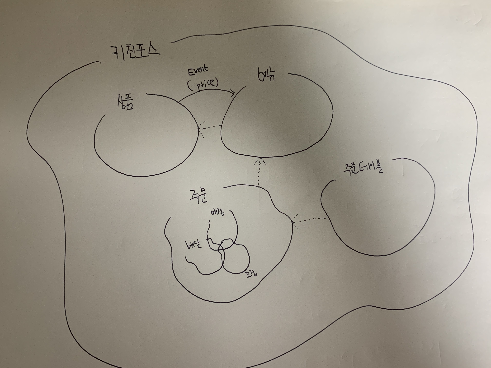

# 모델링
## 모델링 1
### 상품
* `상품(product)`은 `이름(name)`과 `가격(price)`으로 구성된다.
* `상품(product)`의 `이름(name)`은 `비속어(profanity)`를 포함할 수 없다.
* `상품(product)`의 `가격(price)`은 변경될 수 있다.
* `상품(product)`의 `가격(price)`은 `메뉴(Menu)`의 `진열 (displayed)`을 변경시킬 수 있다.

### 메뉴
* `메뉴(menu)`는 `이름(name)`, `원 가격(original price)`, `메뉴 가격(menu price)`, `메뉴 그룹(menu group)`, `진열 여부(displayed)`, 하나 이상의 `메뉴 항목(menu product)` 으로 구성된다.
* `메뉴(menu)`의 `이름(name)`은 `비속어(profanity)`를 포함할 수 없다.
* `메뉴 그룹(menu group)`을 통해 유사한 `메뉴(menu)`들을 모아서 볼 수 있다.
* `메뉴 항목(menu product)`은 `원 상품(product)`과 `항목 수량(menu product quantity)`으로 구성된다.
* 모든 `메뉴 항목(menu product)`의 `원 상품(product)의 가격(price)`과 `항목 수량(quantity)`을 곱한 뒤 모두 합한 가격이 `메뉴(menu)`의 `원 가격(original price)`이 된다.
* `메뉴 가격(menu price)`은 독립적으로 결정할 수 있다.
* `메뉴(menu)`는 `진열 여부(displayed)`에 따라 `숨김 메뉴(hidden menu)`, `진열 메뉴(displayed menu)`로 구분된다.
* `메뉴 가격 정책(menu price policy)`에 따라 `메뉴 가격(menu price)`이 `원 가격(original price)`보다 크면 `숨김 메뉴(hidden menu)`가 된다.
* `메뉴(menu)`는 `메뉴 가격 정책(menu price policy)`와 상관 없이 주인이 자발적으로 `숨길 수 있다 (hide menu)`.
* `메뉴 가격 정책(menu price policy)`을 준수한 메뉴는 `진열할 수 있다(display menu)`.

### 주문
* `주문(order)`은 `주문 유형(order type)`, `주문 상태(order status)`, `주문 시간(order date time)`, 하나 이상의 `주문 항목(order line item)`, `주문 가격(order price)`으로 구성된다.
* `주문(order)`은 `주문 유형(order type)`에 따라 `포장 주문(take out order)`, `배달 주문(delivery order)`, `매장 주문(eat in order)`으로 구분된다.
* `배달 주문(delivery order)`은 `배송지(delivery address)`를 추가로 가지고, `배달 대행사(delivery agency)`를 통해서 `배송지(delivery address)`까지 `주문 항목(order line item)`들이 전달된다.
* `매장 주문(eat in order)`은 식사할 `테이블(table)`을 추가로 가진다.
* `주문 항목(order line item)`은 `주문 메뉴(order line menu)`와 `항목 수량(order line quantity)`으로 구성된다.
* 모든 `주문 항목(order line item)`들의 `주문 메뉴(order line menu)`의 가격과 `항목 수량(order line quantity)`을 곱한 뒤 모두 합한 가격이 `주문 가격(order price)`이 된다.
* `주문 상태(order status)`는 `대기(waiting)`, `수락(accepted)`, `준비 완료(served)`, `배달중(delivering)`, `배달 완료(delivered)`, `완료(completed)`로 총 6개가 존재한다.

### 테이블
* `테이블(table)`은 `이름(name)`, `예약 여부(occupied)`, `손님 수(number of guests)`로 구성된다.
* `테이블(table)`은 `매장 주문(eat in order)`에서만 사용된다.
* `테이블(table)`은 `예약 여부(occupied)`에 따라 `빈 테이블(empty table)`, `예약 테이블(reserved table)`로 구분된다.
* `매장 주문(eat in order)` 시작시에 `빈 테이블(empty table)`을 `예약(reserve)`하고, `손님 수(number of guests)`를 명시하면 `빈 테이블(empty table)`이 `예약 테이블(reserved table)`이 된다.
* `예약 테이블(reserved table)`에 한해 `손님 수(number of guests)`를 변경할 수 있다.
* `매장 주문(eat in order)`이 `종료(completed)`되면 사용한 `예약 테이블(reserved table)`을 `비워서(clear)` `빈 테이블(empty table)`로 만들고, `테이블(table)`의 `손님 수(number of guests)`기 0명으로 변경된다.

## 모델링 2

